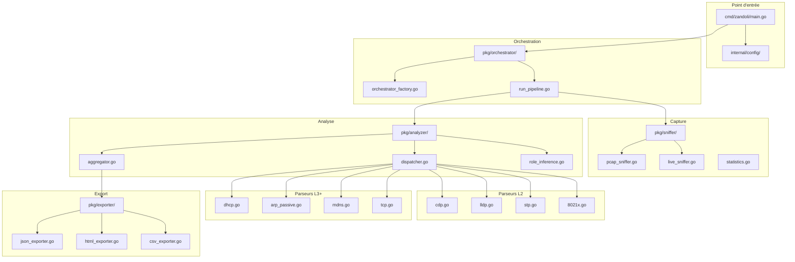
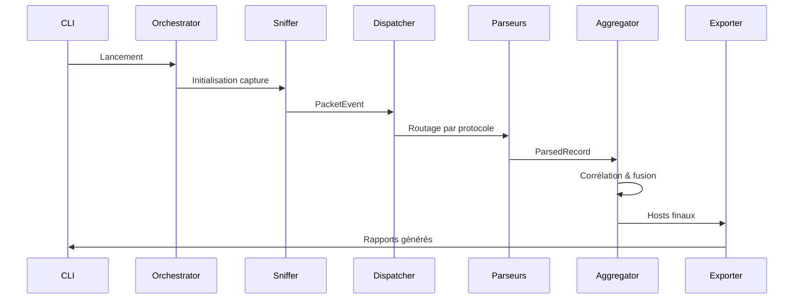
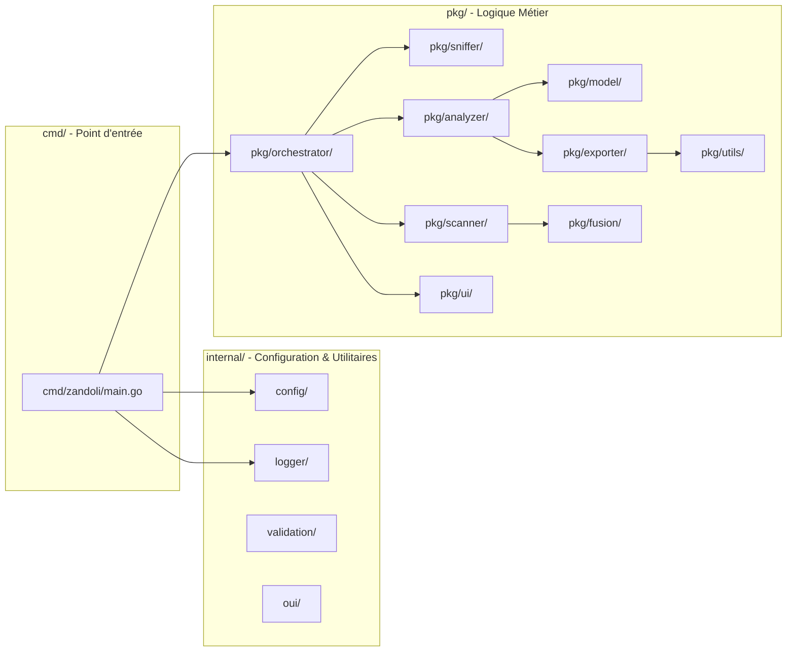
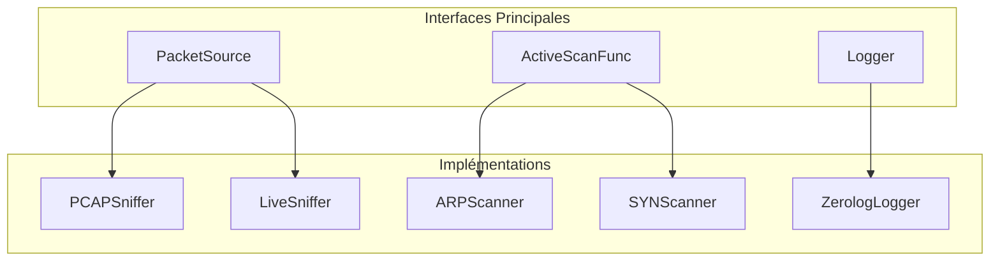
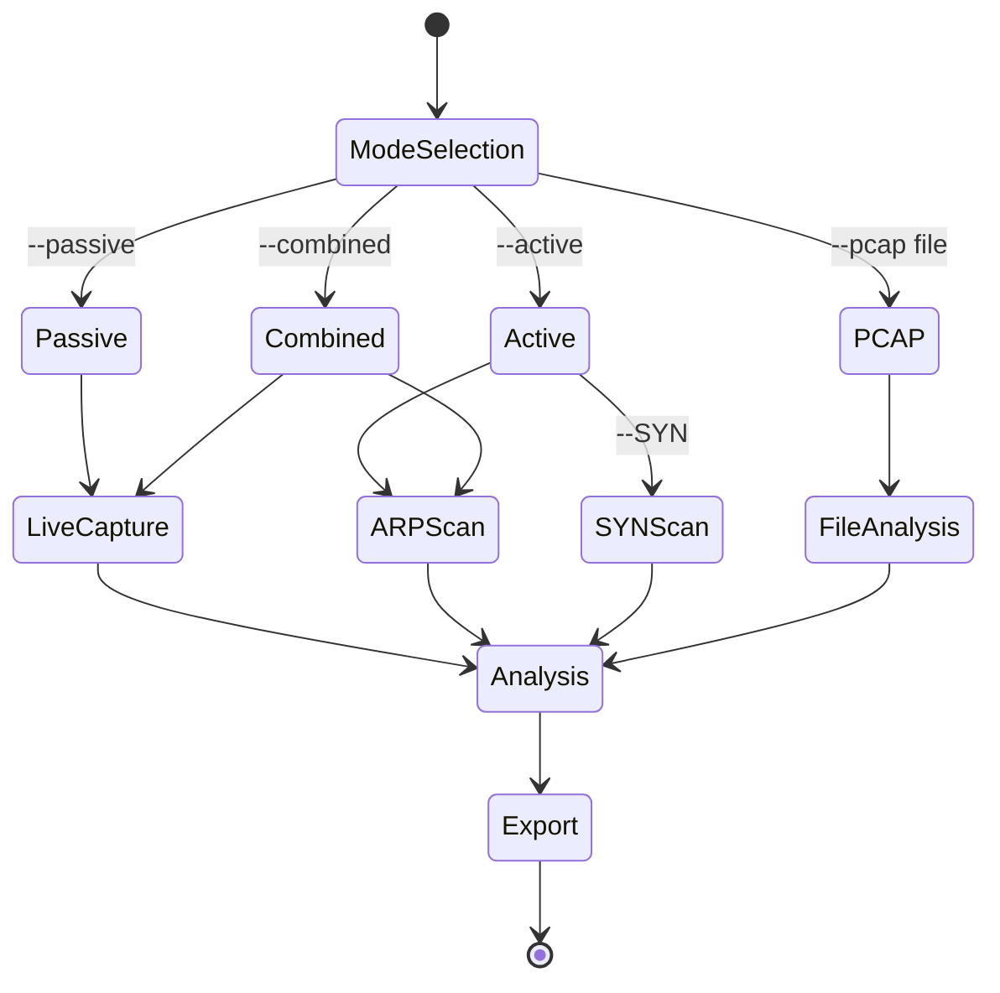
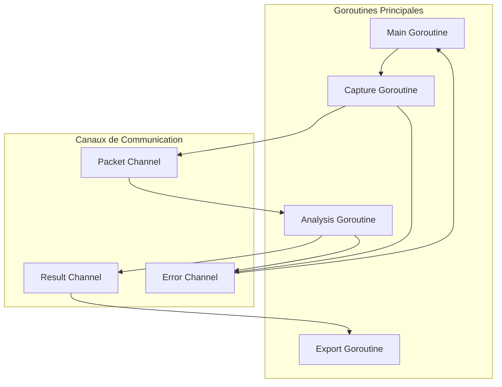
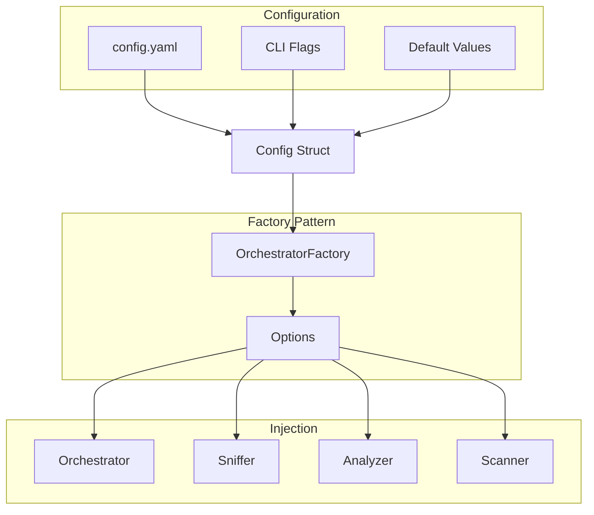

# Schémas d'Architecture Zandoli

## Vue d'ensemble des Modules

## Flux de Données Principal

## Séparation des Couches

## Interfaces et Dépendances

## Modes d'Exécution

## Gestion de la Concurrence

## Configuration et Injection de Dépendances

