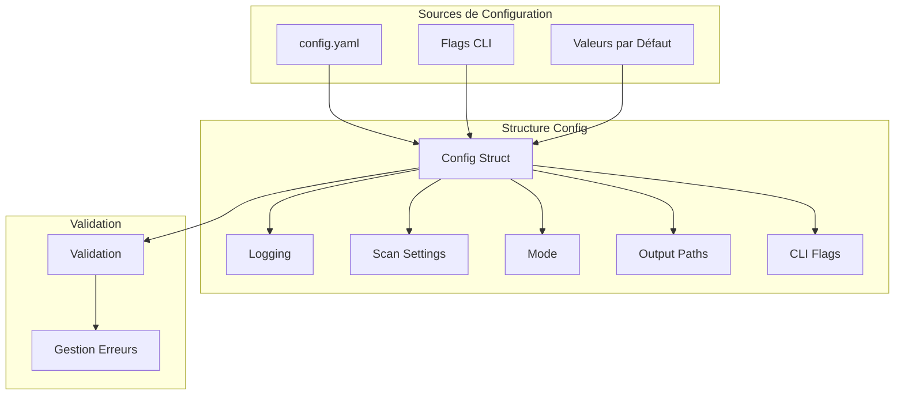
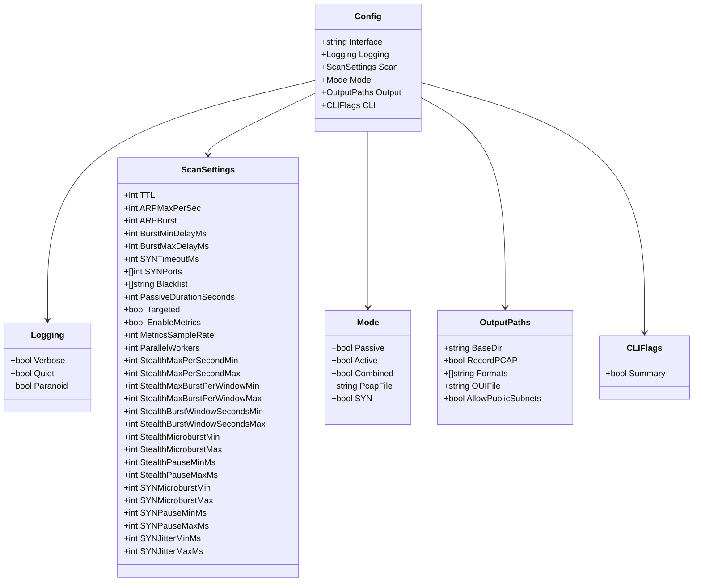
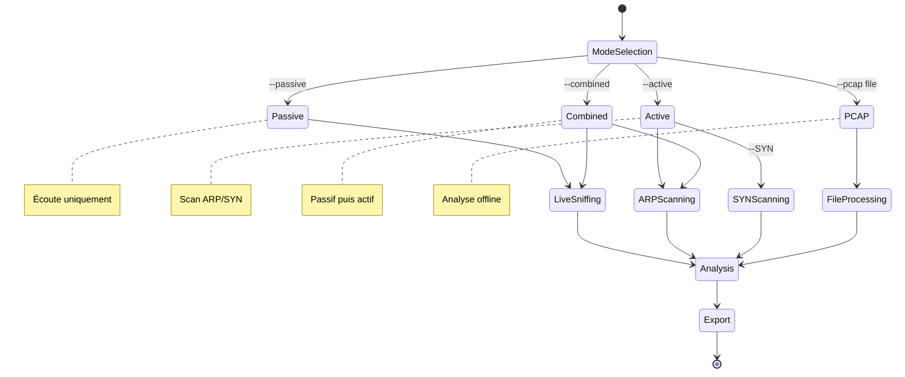
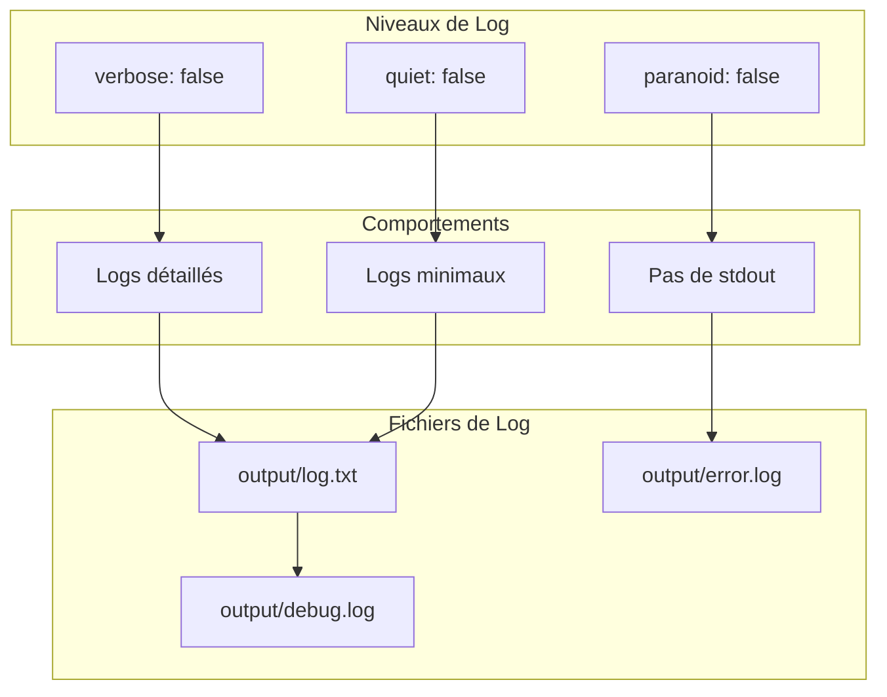
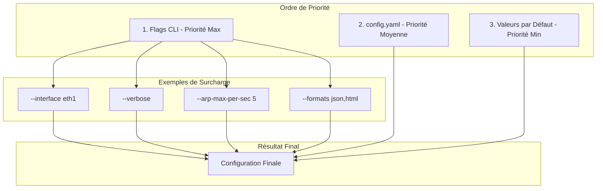
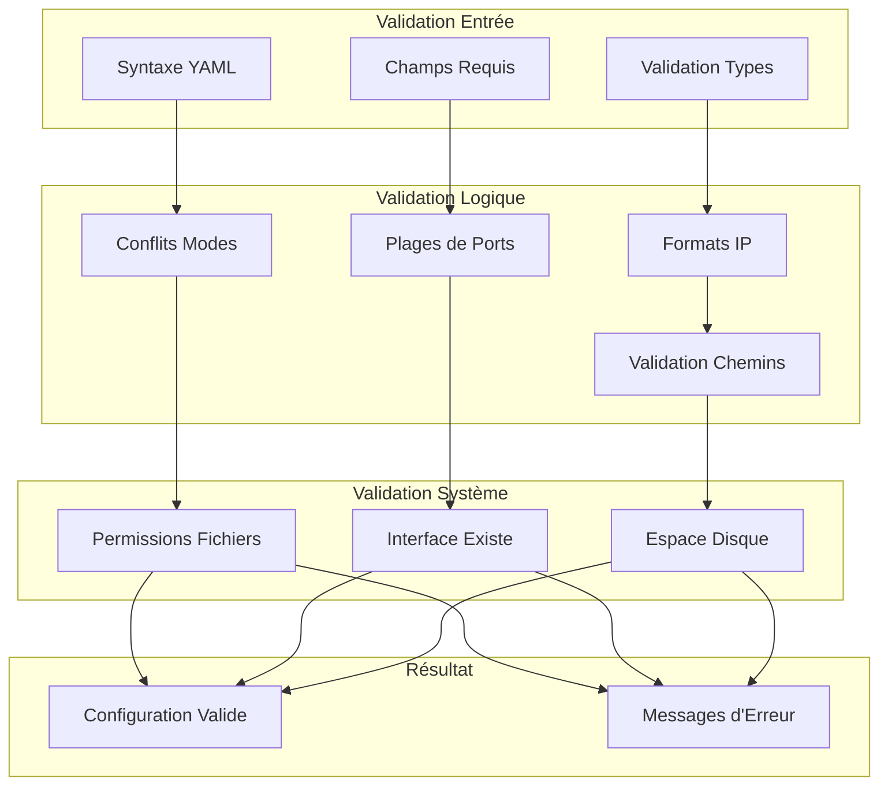
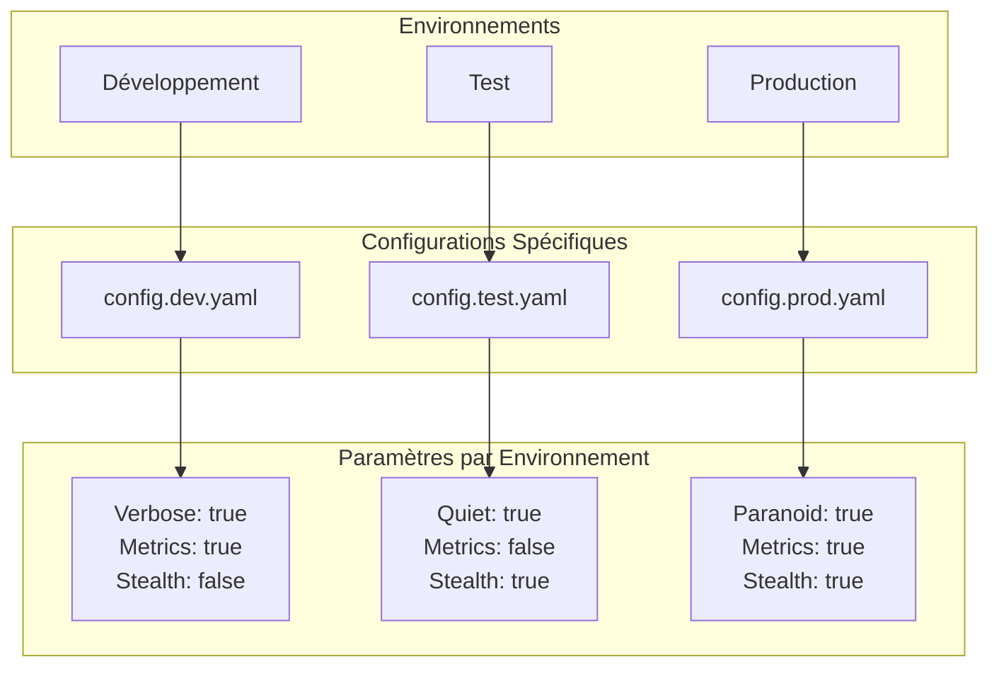
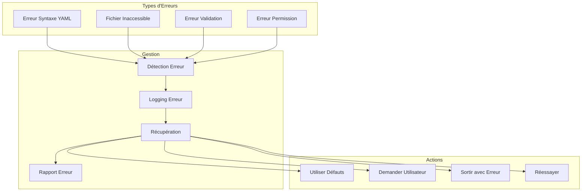
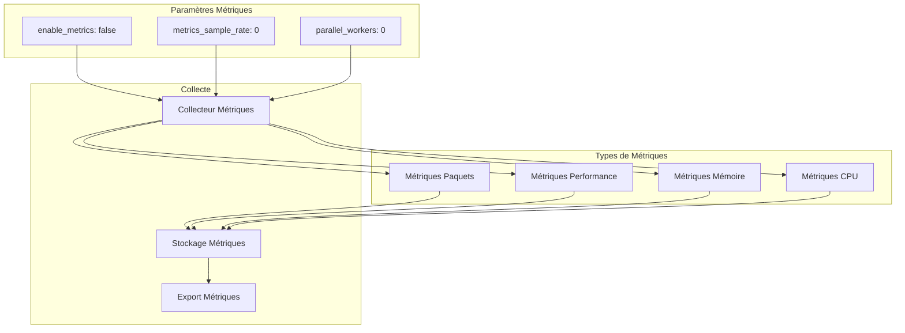

# Schémas de Configuration Zandoli

## Vue d'ensemble de la Configuration



## Structure de Configuration Complète



## Modes d'Exécution



## Configuration des Scans

```mermaid
graph TD
    subgraph "Paramètres ARP"
        ARP_MAX_PER_SEC[arp_max_per_sec: 3]
        ARP_BURST[arp_burst: 10]
        BURST_MIN_DELAY[burst_min_delay_ms: 100]
        BURST_MAX_DELAY[burst_max_delay_ms: 500]
    end
    
    subgraph "Paramètres SYN"
        SYN_TIMEOUT[syn_timeout_ms: 1000]
        SYN_PORTS[syn_ports: [80,443,22]]
        SYN_ENABLED[SYN: false]
    end
    
    subgraph "Paramètres Généraux"
        TTL_VALUE[ttl: 64]
        BLACKLIST[blacklist: []]
        TARGETED[targeted: false]
        PASSIVE_DURATION[passive_duration_seconds: 0]
    end
    
    subgraph "Paramètres Stealth"
        STEALTH_MIN[stealth_max_per_second_min: 1]
        STEALTH_MAX[stealth_max_per_second_max: 5]
        STEALTH_BURST_MIN[stealth_max_burst_per_window_min: 2]
        STEALTH_BURST_MAX[stealth_max_burst_per_window_max: 8]
    end
    
    ARP_MAX_PER_SEC --> SCAN_CONFIG
    ARP_BURST --> SCAN_CONFIG
    BURST_MIN_DELAY --> SCAN_CONFIG
    BURST_MAX_DELAY --> SCAN_CONFIG
    SYN_TIMEOUT --> SCAN_CONFIG
    SYN_PORTS --> SCAN_CONFIG
    SYN_ENABLED --> SCAN_CONFIG
    TTL_VALUE --> SCAN_CONFIG
    BLACKLIST --> SCAN_CONFIG
    TARGETED --> SCAN_CONFIG
    PASSIVE_DURATION --> SCAN_CONFIG
    STEALTH_MIN --> SCAN_CONFIG
    STEALTH_MAX --> SCAN_CONFIG
    STEALTH_BURST_MIN --> SCAN_CONFIG
    STEALTH_BURST_MAX --> SCAN_CONFIG
    
    SCAN_CONFIG[Configuration Scan]
```

## Configuration des Logs



## Configuration des Exports

```mermaid
graph TD
    subgraph "Répertoire de Sortie"
        BASE_DIR[base_dir: "output"]
    end
    
    subgraph "Formats Disponibles"
        JSON_FORMAT[json]
        HTML_FORMAT[html]
        CSV_FORMAT[csv]
        XML_FORMAT[xml]
        MARKDOWN_FORMAT[markdown]
        IPSET_FORMAT[ipset]
    end
    
    subgraph "Options Supplémentaires"
        RECORD_PCAP[record_pcap: false]
        OUI_FILE[oui_file: ""]
        ALLOW_PUBLIC[allow_public_subnets: false]
    end
    
    subgraph "Fichiers Générés"
        HOSTS_JSON[hosts.json]
        SUBNETS_JSON[subnets.json]
        ANOMALIES_JSON[anomalies.json]
        REPORT_HTML[report.html]
        HOSTS_CSV[hosts.csv]
        SUBNETS_CSV[subnets.csv]
        HOSTS_XML[hosts.xml]
        REPORT_MD[report.md]
        HOSTS_IPSET[hosts.ipset]
    end
    
    BASE_DIR --> JSON_FORMAT
    BASE_DIR --> HTML_FORMAT
    BASE_DIR --> CSV_FORMAT
    BASE_DIR --> XML_FORMAT
    BASE_DIR --> MARKDOWN_FORMAT
    BASE_DIR --> IPSET_FORMAT
    
    JSON_FORMAT --> HOSTS_JSON
    JSON_FORMAT --> SUBNETS_JSON
    JSON_FORMAT --> ANOMALIES_JSON
    
    HTML_FORMAT --> REPORT_HTML
    
    CSV_FORMAT --> HOSTS_CSV
    CSV_FORMAT --> SUBNETS_CSV
    
    XML_FORMAT --> HOSTS_XML
    
    MARKDOWN_FORMAT --> REPORT_MD
    
    IPSET_FORMAT --> HOSTS_IPSET
    
    RECORD_PCAP --> BASE_DIR
    OUI_FILE --> BASE_DIR
    ALLOW_PUBLIC --> BASE_DIR
```

## Priorité de Configuration



## Validation de Configuration



## Configuration par Environnement



## Gestion des Erreurs de Configuration



## Configuration des Métriques


