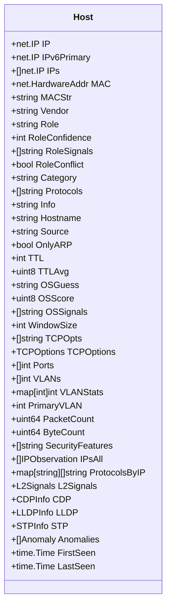
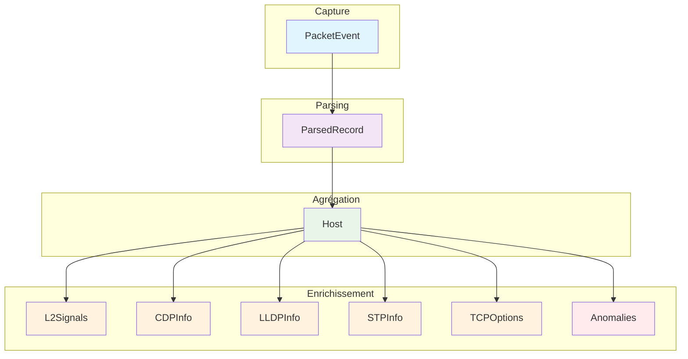
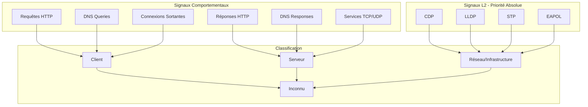
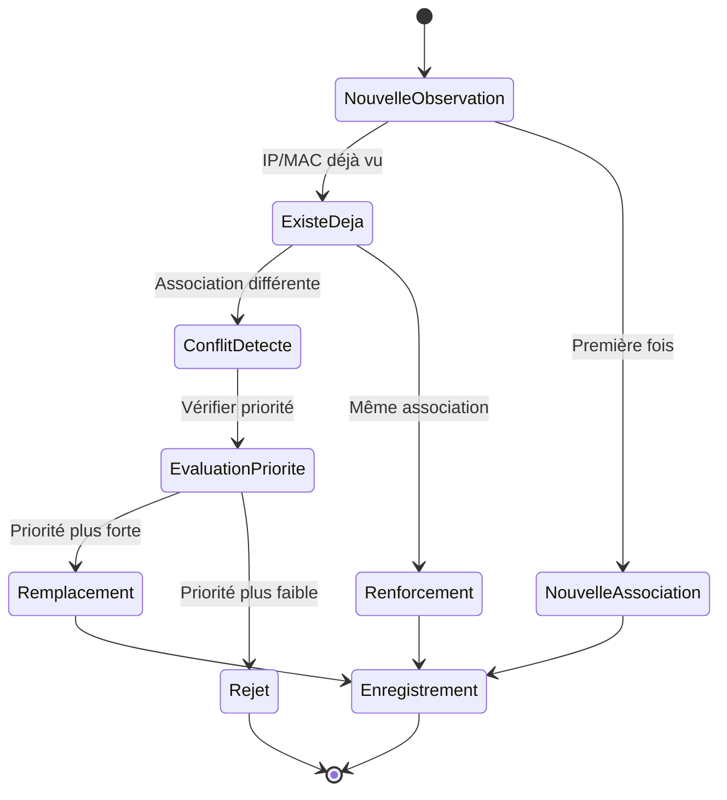
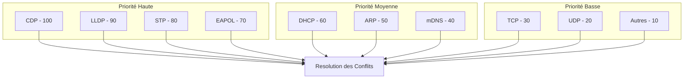
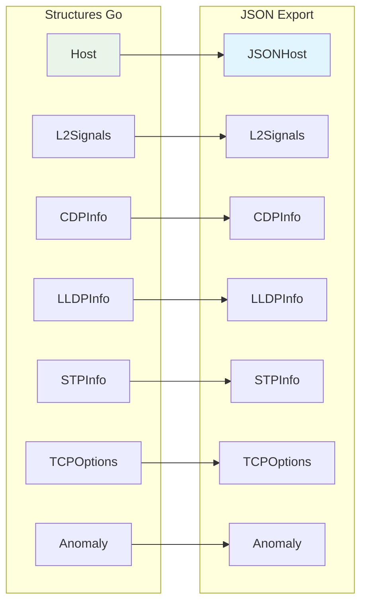
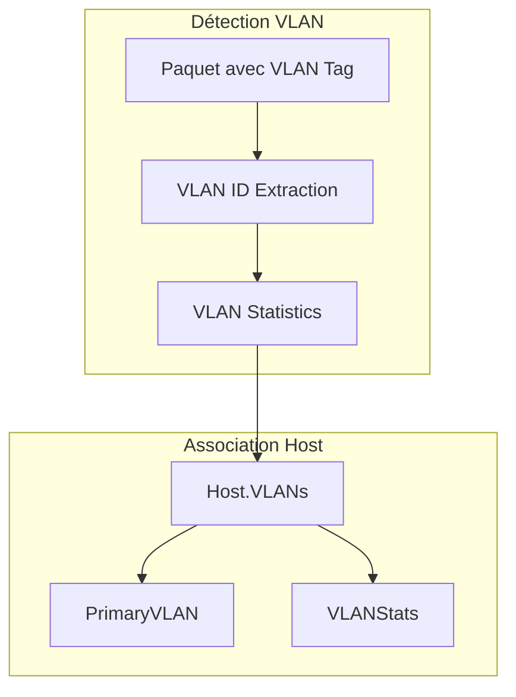
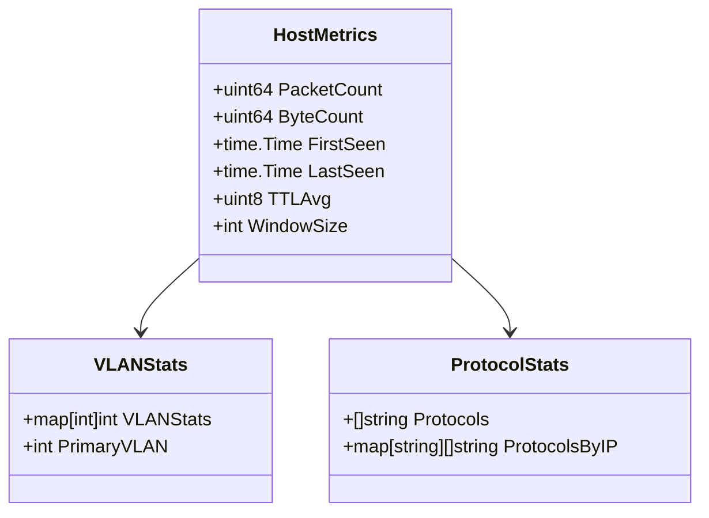

# Schémas du Modèle de Données Zandoli

## Structure Host - Vue d'ensemble



## Relations entre Entités

```mermaid
erDiagram
    Host ||--o{ IPObservation : "a plusieurs"
    Host ||--o{ Anomaly : "peut avoir"
    Host ||--|| L2Signals : "possède"
    Host ||--o| CDPInfo : "peut avoir"
    Host ||--o| LLDPInfo : "peut avoir"
    Host ||--o| STPInfo : "peut avoir"
    Host ||--o| TCPOptions : "peut avoir"
    
    IPObservation {
        string IP
        string Source
        int Strength
        time.Time FirstSeen
        time.Time LastSeen
    }
    
    Anomaly {
        string Type
        string Description
        string Severity
        string Key
        string Scope
        map[string]interface{} Details
    }
    
    L2Signals {
        bool EAPOL
        bool STP
        bool LLDP
        bool CDP
        []int VLANs
    }
    
    CDPInfo {
        string DeviceID
        string PortID
        string Platform
        string Version
        uint32 Capabilities
        int NativeVLAN
        []string Addresses
        []string DecodedCaps
    }
    
    LLDPInfo {
        string ChassisID
        string PortID
        string SysName
        string SysDescr
        []string MgmtAddrs
        []string Capabilities
    }
    
    STPInfo {
        string RootBridgeID
        string BridgeID
        int RootPathCost
        string PortID
        int MessageAge
        int MaxAge
        int HelloTime
        int ForwardDelay
    }
    
    TCPOptions {
        int MSS
        int WSCALE
        bool SACKPermitted
        bool Timestamp
        int NOPCount
        []string Order
        []int MSSSamples
        []int WScaleSamples
        int TCPFPConfidence
    }
```

## Flux de Données - PacketEvent vers Host



## Classification des Rôles



## Gestion des Conflits IP↔MAC



## Matrice de Priorité des Protocoles



## Structure des Anomalies

```mermaid
classDiagram
    class Anomaly {
        +string Type
        +string Description
        +string Severity
        +string Key
        +string Scope
        +map[string]interface{} Details
    }
    
    class AnomalyTypes {
        <<enumeration>>
        MultipleDHCPServers
        SuspiciousTTL
        UnusualPorts
        MACAnomalies
    }
    
    class AnomalySeverity {
        <<enumeration>>
        High
        Medium
        Low
    }
    
    Anomaly --> AnomalyTypes
    Anomaly --> AnomalySeverity
```

## Sérialisation JSON



## Gestion des VLANs



## Métriques et Statistiques


