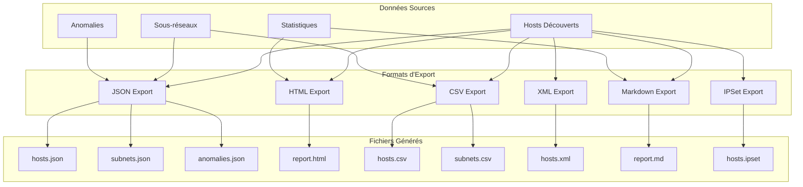
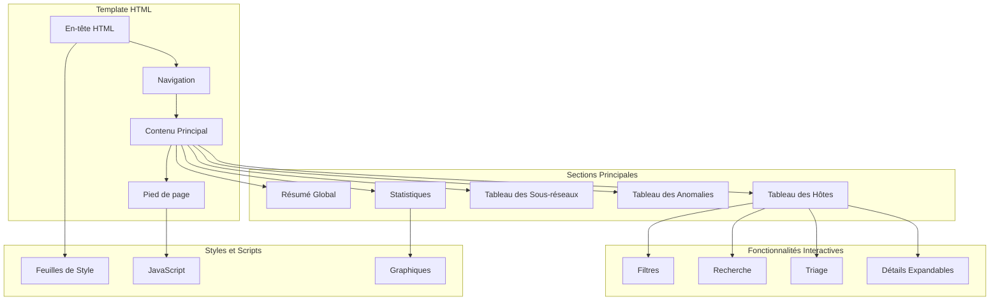
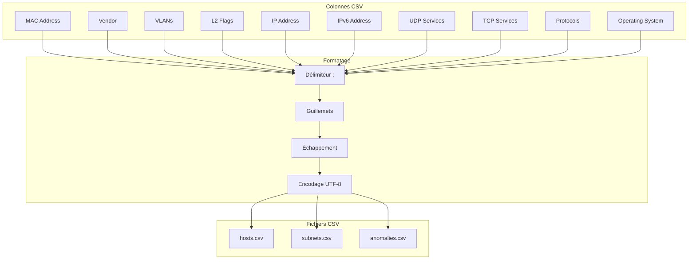
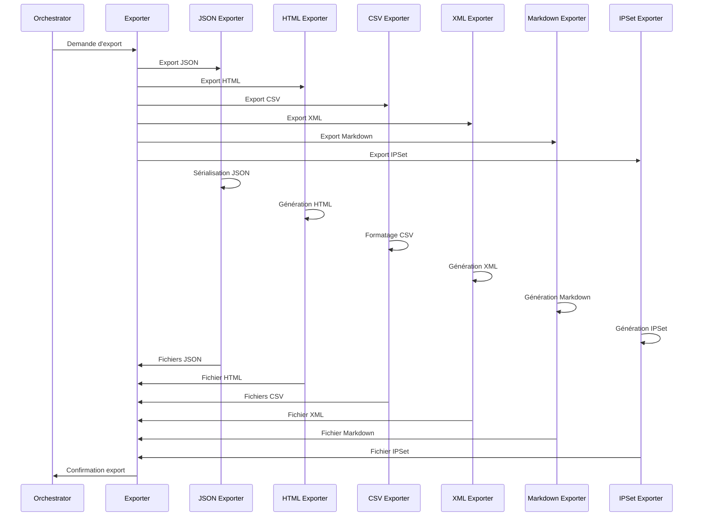
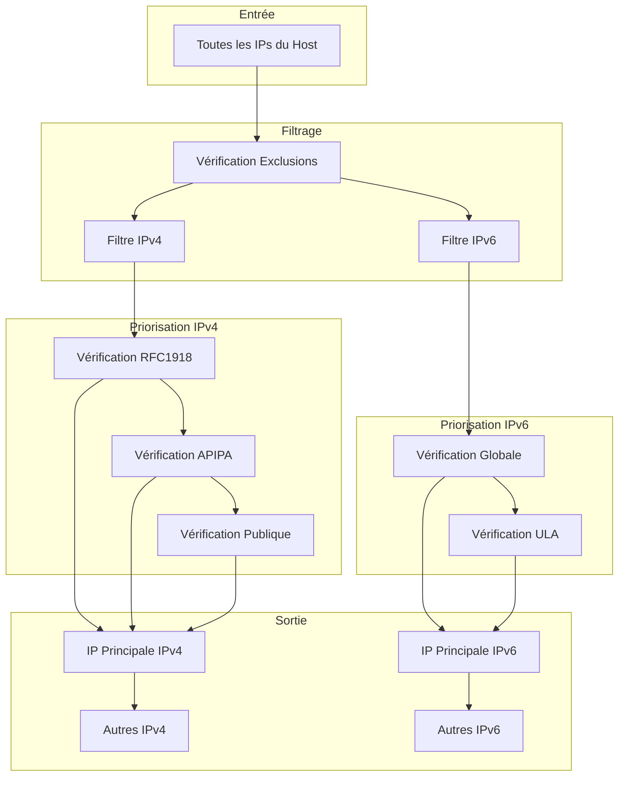
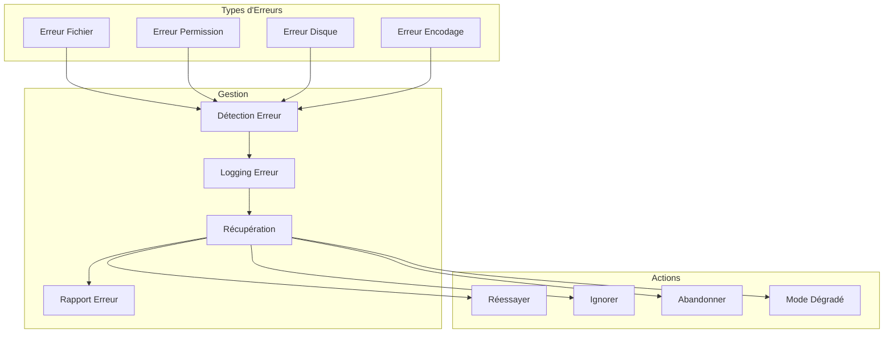
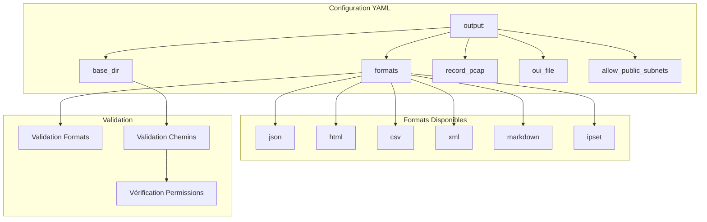

# Schémas des Formats d'Export Zandoli

## Vue d'ensemble des Exports



## Structure JSON

```mermaid
classDiagram
    class JSONHost {
        +string ip
        +string ipv6
        +string macStr
        +string vendor
        +string role
        +int roleConfidence
        +[]string roleSignals
        +[]string protocols
        +string info
        +string hostname
        +int ttl
        +string osGuess
        +uint8 osScore
        +[]string osSignals
        +int windowSize
        +TCPOptions tcpOptions
        +[]int ports
        +[]int vlans
        +map[int]int vlanStats
        +int primaryVlan
        +uint64 packetCount
        +uint64 byteCount
        +[]string securityFeatures
        +[]string ips
        +[]IPObservation ipsAll
        +map[string][]string protocolsByIP
        +L2Signals l2Signals
        +CDPInfo cdp
        +LLDPInfo lldp
        +STPInfo stp
        +[]Anomaly anomalies
        +time.Time firstSeen
        +time.Time lastSeen
    }
    
    class JSONSubnet {
        +string network
        +string gateway
        +int hostCount
        +[]string hosts
        +map[string]int roleDistribution
        +map[string]int vendorDistribution
        +[]string anomalies
    }
    
    class JSONAnomaly {
        +string type
        +string description
        +string severity
        +string key
        +string scope
        +map[string]interface{} details
    }
    
    JSONHost --> JSONAnomaly
    JSONSubnet --> JSONHost
```

## Structure HTML



## Structure CSV



## Flux de Génération des Exports



## Sélection des IPs pour l'Export



## Template HTML - Structure Détaillée

```mermaid
graph TD
    subgraph "En-tête HTML"
        DOCTYPE[DOCTYPE html]
        HTML_TAG[html lang="fr"]
        HEAD[head]
        META[Meta tags]
        TITLE[Titre]
        CSS_LINKS[Liens CSS]
    end
    
    subgraph "Corps Principal"
        BODY[body]
        HEADER[header]
        NAV[nav]
        MAIN[main]
        FOOTER[footer]
    end
    
    subgraph "Contenu Principal"
        SUMMARY_SECTION[Section Résumé]
        HOSTS_SECTION[Section Hôtes]
        SUBNETS_SECTION[Section Sous-réseaux]
        ANOMALIES_SECTION[Section Anomalies]
        STATS_SECTION[Section Statistiques]
    end
    
    subgraph "Composants Interactifs"
        FILTER_PANEL[Panneau Filtres]
        SEARCH_BOX[Boîte Recherche]
        SORT_CONTROLS[Contrôles Tri]
        DETAIL_MODAL[Modal Détails]
    end
    
    DOCTYPE --> HTML_TAG
    HTML_TAG --> HEAD
    HTML_TAG --> BODY
    
    HEAD --> META
    HEAD --> TITLE
    HEAD --> CSS_LINKS
    
    BODY --> HEADER
    BODY --> NAV
    BODY --> MAIN
    BODY --> FOOTER
    
    MAIN --> SUMMARY_SECTION
    MAIN --> HOSTS_SECTION
    MAIN --> SUBNETS_SECTION
    MAIN --> ANOMALIES_SECTION
    MAIN --> STATS_SECTION
    
    HOSTS_SECTION --> FILTER_PANEL
    HOSTS_SECTION --> SEARCH_BOX
    HOSTS_SECTION --> SORT_CONTROLS
    HOSTS_SECTION --> DETAIL_MODAL
```

## Gestion des Erreurs d'Export



## Métriques d'Export

```mermaid
graph TB
    subgraph "Métriques Temps"
        EXPORT_TIME[Temps Export Total]
        JSON_TIME[Temps Export JSON]
        HTML_TIME[Temps Export HTML]
        CSV_TIME[Temps Export CSV]
    end
    
    subgraph "Métriques Taille"
        JSON_SIZE[Taille Fichiers JSON]
        HTML_SIZE[Taille Fichier HTML]
        CSV_SIZE[Taille Fichiers CSV]
        TOTAL_SIZE[Taille Totale]
    end
    
    subgraph "Métriques Performance"
        HOSTS_COUNT[Nombre Hôtes Exportés]
        SUBNETS_COUNT[Nombre Sous-réseaux]
        ANOMALIES_COUNT[Nombre Anomalies]
        SUCCESS_RATE[Taux de Succès]
    end
    
    EXPORT_TIME --> DASHBOARD[Dashboard Métriques]
    JSON_TIME --> DASHBOARD
    HTML_TIME --> DASHBOARD
    CSV_TIME --> DASHBOARD
    
    JSON_SIZE --> DASHBOARD
    HTML_SIZE --> DASHBOARD
    CSV_SIZE --> DASHBOARD
    TOTAL_SIZE --> DASHBOARD
    
    HOSTS_COUNT --> DASHBOARD
    SUBNETS_COUNT --> DASHBOARD
    ANOMALIES_COUNT --> DASHBOARD
    SUCCESS_RATE --> DASHBOARD
```



## Configuration des Exports


