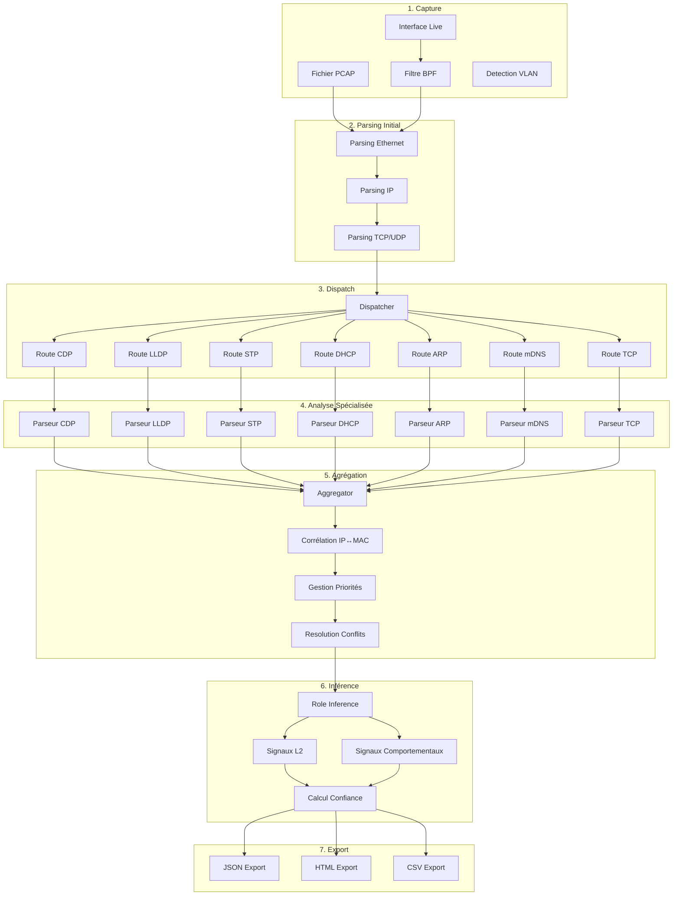
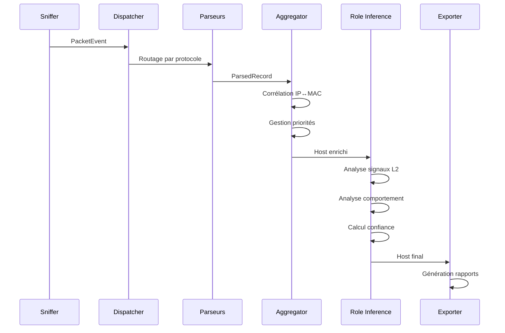
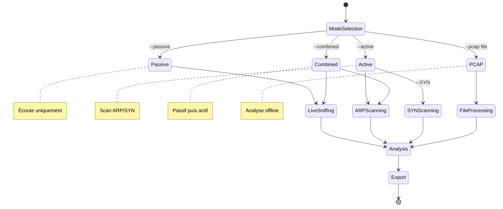
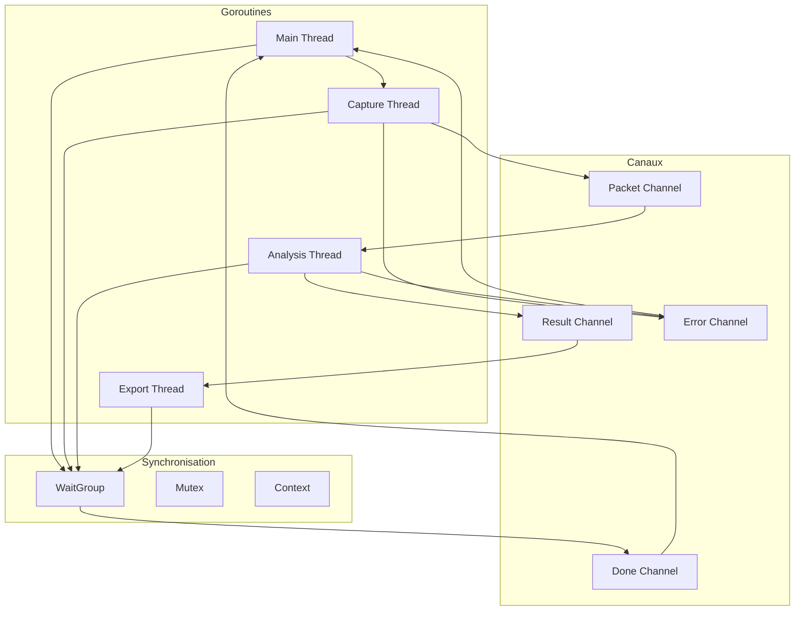
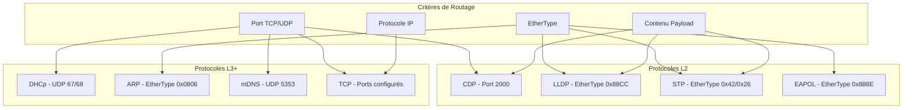
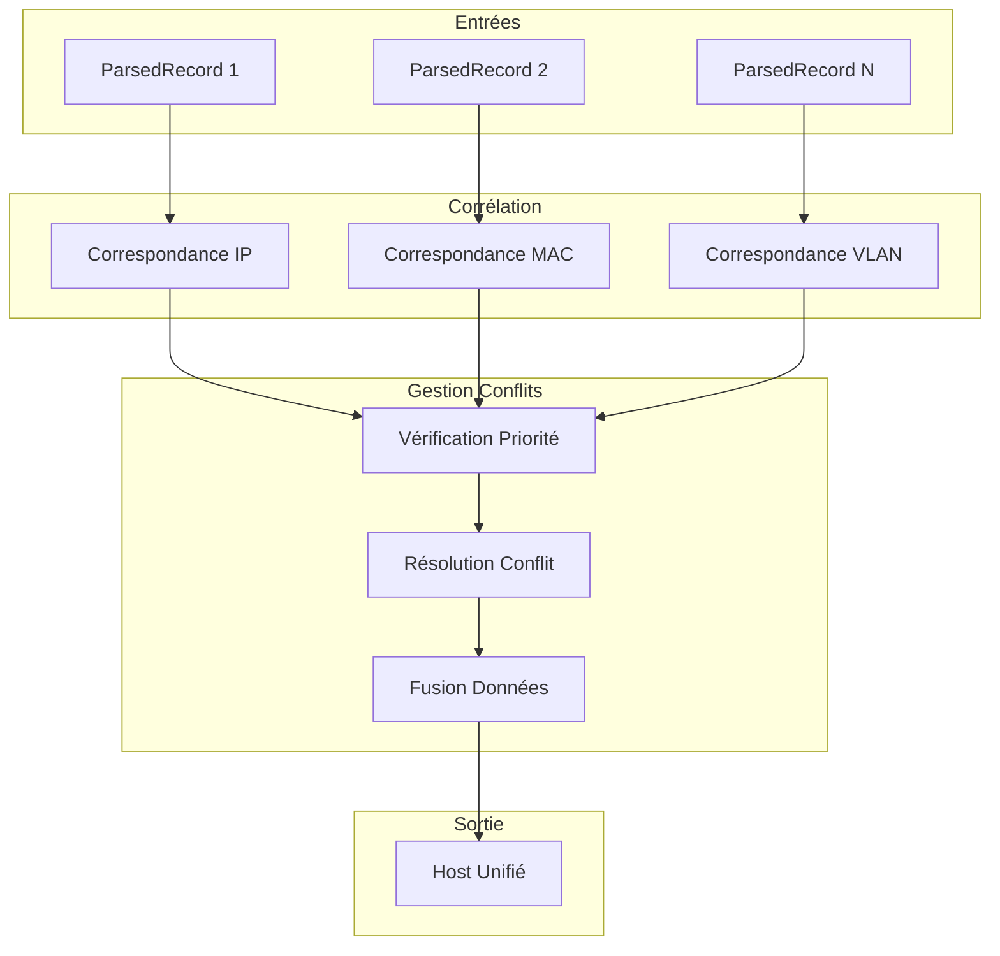
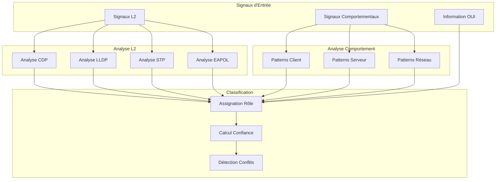
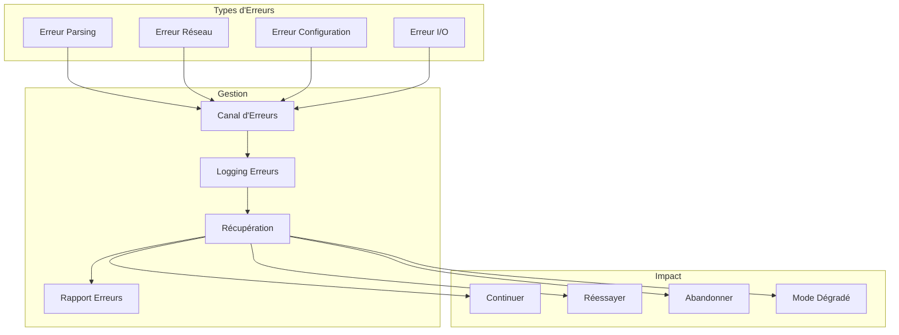

# Schémas du Pipeline de Traitement Zandoli

## Vue d'ensemble du Pipeline

## Flux de Données Détaillé

## Modes d'Exécution

## Gestion de la Concurrence

## Pipeline de Parsing

```mermaid
flowchart LR
    subgraph "Parsing Ethernet"
        ETH_HEADER[En-tête Ethernet]
        ETH_TYPE[EtherType]
        VLAN_TAG[VLAN Tag 802.1Q]
    end
    
    subgraph "Parsing IP"
        IP_HEADER[En-tête IP]
        IP_VERSION[Version IPv4/IPv6]
        IP_TTL[TTL/Hop Limit]
        IP_PROTO[Protocole]
    end
    
    subgraph "Parsing Transport"
        TCP_HEADER[En-tête TCP]
        UDP_HEADER[En-tête UDP]
        TCP_OPTIONS[Options TCP]
        PORTS[Ports Source/Dest]
    end
    
    subgraph "Parsing Application"
        PAYLOAD[Payload]
        PROTOCOL_ID[Identification Protocole]
        TLV_PARSING[Parsing TLV]
    end
    
    ETH_HEADER --> ETH_TYPE
    ETH_TYPE --> VLAN_TAG
    VLAN_TAG --> IP_HEADER
    IP_HEADER --> IP_VERSION
    IP_VERSION --> IP_TTL
    IP_TTL --> IP_PROTO
    IP_PROTO --> TCP_HEADER
    IP_PROTO --> UDP_HEADER
    TCP_HEADER --> TCP_OPTIONS
    TCP_OPTIONS --> PORTS
    UDP_HEADER --> PORTS
    PORTS --> PAYLOAD
    PAYLOAD --> PROTOCOL_ID
    PROTOCOL_ID --> TLV_PARSING
```

## Dispatch des Protocoles

## Agrégation et Corrélation

## Inférence de Rôle

## Gestion des Erreurs

## Métriques et Performance

```mermaid
graph TB
    subgraph "Métriques Capture"
        PACKETS_PER_SEC[Paquets/seconde]
        BYTES_PER_SEC[Octets/seconde]
        DROPPED_PACKETS[Paquets perdus]
        BUFFER_USAGE[Utilisation buffer]
    end
    
    subgraph "Métriques Analyse"
        PARSE_TIME[Temps parsing]
        CORRELATION_TIME[Temps corrélation]
        MEMORY_USAGE[Utilisation mémoire]
        CPU_USAGE[Utilisation CPU]
    end
    
    subgraph "Métriques Export"
        EXPORT_TIME[Temps export]
        FILE_SIZE[Taille fichiers]
        COMPRESSION_RATIO[Taux compression]
    end
    
    PACKETS_PER_SEC --> DASHBOARD[Dashboard]
    BYTES_PER_SEC --> DASHBOARD
    DROPPED_PACKETS --> DASHBOARD
    BUFFER_USAGE --> DASHBOARD
    
    PARSE_TIME --> DASHBOARD
    CORRELATION_TIME --> DASHBOARD
    MEMORY_USAGE --> DASHBOARD
    CPU_USAGE --> DASHBOARD
    
    EXPORT_TIME --> DASHBOARD
    FILE_SIZE --> DASHBOARD
    COMPRESSION_RATIO --> DASHBOARD
```

