# Architecture

This document describes Zandoli's system architecture, module relationships, and data flow patterns.

## System Overview

Zandoli follows a layered architecture with clear separation of concerns:

- **Command Layer**: CLI interface and configuration management
- **Orchestration Layer**: Pipeline coordination and workflow management
- **Processing Layer**: Packet analysis, protocol parsing, and data aggregation
- **Export Layer**: Report generation in multiple formats
- **Infrastructure Layer**: Logging, validation, and utility functions

## Architecture Diagram

```mermaid
flowchart TD
    CLI[CLI Interface<br/>cmd/zandoli] --> Config[Configuration<br/>internal/config]
    CLI --> Orch[Orchestrator<br/>pkg/orchestrator]
    
    Orch --> Sniffer[Packet Sniffer<br/>pkg/sniffer]
    Orch --> Scanner[Active Scanner<br/>pkg/scanner]
    Orch --> Analyzer[Packet Analyzer<br/>pkg/analyzer]
    
    Sniffer --> PCAP[PCAP Files]
    Sniffer --> Live[Live Capture]
    Scanner --> ARP[ARP Scanner]
    Scanner --> SYN[SYN Scanner]
    
    Analyzer --> Dispatcher[Protocol Dispatcher]
    Dispatcher --> CDP[CDP Parser]
    Dispatcher --> LLDP[LLDP Parser]
    Dispatcher --> STP[STP Parser]
    Dispatcher --> DHCP[DHCP Parser]
    Dispatcher --> ARPParser[ARP Parser]
    Dispatcher --> TCPParser[TCP Parser]
    
    Analyzer --> Aggregator[Data Aggregator<br/>pkg/analyzer]
    Aggregator --> RoleInference[Role Inference]
    Aggregator --> AnomalyDetection[Anomaly Detection]
    Aggregator --> Topology[Topology Builder]
    
    Orch --> Fusion[Data Fusion<br/>pkg/fusion]
    Fusion --> PassiveData[Passive Data]
    Fusion --> ActiveData[Active Data]
    
    Orch --> Exporters[Export Layer<br/>pkg/exporter]
    Exporters --> HTML[HTML Exporter]
    Exporters --> CSV[CSV Exporter]
    Exporters --> JSON[JSON Exporter]
    Exporters --> MD[Markdown Exporter]
    Exporters --> XML[XML Exporter]
    
    Exporters --> Output[Output Files<br/>HTML/CSV/JSON/MD/XML]
    
    Config --> Logger[Logging<br/>internal/logger]
    Config --> Validation[Validation<br/>internal/validation]
    
    Logger --> LogFile[Log Files]
    Validation --> OUI[OUI Database<br/>internal/oui]
    
    Model[Data Models<br/>pkg/model] --> Aggregator
    Model --> Exporters
    Model --> Analyzer
    
    Utils[Utilities<br/>pkg/utils] --> Aggregator
    Utils --> Exporters
    Utils --> Analyzer
    
    UI[UI Components<br/>pkg/ui] --> Orch
```



## Module Responsibilities

### Core Modules

#### `pkg/orchestrator`
- **Purpose**: Central coordination of the entire pipeline
- **Responsibilities**:
  - Mode management (passive, active, combined, PCAP)
  - Pipeline execution flow
  - Resource coordination
  - Progress reporting

#### `pkg/sniffer`
- **Purpose**: Packet capture and source management
- **Responsibilities**:
  - Live packet capture from network interfaces
  - PCAP file reading and parsing
  - Packet filtering and preprocessing
  - Performance optimization for large captures

#### `pkg/analyzer`
- **Purpose**: Core packet analysis and protocol parsing
- **Responsibilities**:
  - Protocol dispatcher (CDP, LLDP, STP, DHCP, ARP, TCP, etc.)
  - Data aggregation and correlation
  - Role inference algorithms
  - Anomaly detection
  - Topology construction

#### `pkg/scanner`
- **Purpose**: Active network scanning
- **Responsibilities**:
  - ARP scanning for host discovery
  - SYN scanning for service detection
  - Rate limiting and stealth modes
  - Blacklist management

#### `pkg/fusion`
- **Purpose**: Data integration from multiple sources
- **Responsibilities**:
  - Merging passive and active scan results
  - Conflict resolution
  - Data deduplication
  - Quality assessment

#### `pkg/exporter`
- **Purpose**: Report generation in multiple formats
- **Responsibilities**:
  - HTML report generation with interactive features
  - CSV export with semicolon delimiters
  - JSON export for machine consumption
  - Markdown and XML formats
  - Data formatting and presentation

### Infrastructure Modules

#### `internal/config`
- **Purpose**: Configuration management
- **Responsibilities**:
  - YAML configuration parsing
  - Default value management
  - CLI flag integration
  - Validation

#### `internal/logger`
- **Purpose**: Structured logging
- **Responsibilities**:
  - Multi-level logging (verbose, quiet, paranoid)
  - File and console output
  - Log rotation and management
  - Performance logging

#### `internal/validation`
- **Purpose**: Input validation and sanitization
- **Responsibilities**:
  - Flag validation
  - Network interface validation
  - IP address and subnet validation
  - Configuration validation

#### `internal/oui`
- **Purpose**: MAC address vendor lookup
- **Responsibilities**:
  - OUI database loading and parsing
  - Vendor identification
  - Network device classification

#### `pkg/model`
- **Purpose**: Core data structures
- **Responsibilities**:
  - Host representation
  - Protocol-specific data structures
  - Anomaly definitions
  - Network topology models

#### `pkg/utils`
- **Purpose**: Common utilities and helpers
- **Responsibilities**:
  - IP address utilities
  - MAC address processing
  - String manipulation
  - Network calculations

#### `pkg/ui`
- **Purpose**: User interface components
- **Responsibilities**:
  - Progress bars and indicators
  - Summary displays
  - Interactive features

## Data Flow

### 1. Input Processing
```
Network Traffic/PCAP → Sniffer → Packet Events → Protocol Dispatcher
```

### 2. Protocol Analysis
```
Packet Events → Protocol Parsers → Parsed Records → Aggregator
```

### 3. Data Aggregation
```
Parsed Records → Host Objects → Role Inference → Anomaly Detection
```

### 4. Data Fusion
```
Passive Data + Active Data → Fusion → Unified Host Database
```

### 5. Export Generation
```
Unified Data → Exporters → Formatted Reports (HTML/CSV/JSON/MD/XML)
```

## Extension Points

### Adding New Protocol Parsers

1. **Create Parser Module**: Add new parser in `pkg/analyzer/`
2. **Register with Dispatcher**: Update `pkg/analyzer/dispatcher.go`
3. **Define Data Structures**: Add protocol-specific types in `pkg/model/`
4. **Update Aggregator**: Integrate new protocol data into host objects

### Adding New Export Formats

1. **Create Exporter**: Add new exporter in `pkg/exporter/`
2. **Implement Export Interface**: Follow existing exporter patterns
3. **Update CLI**: Add format option in `cmd/zandoli/main.go`
4. **Update Orchestrator**: Integrate new exporter in pipeline

### Adding New Scan Types

1. **Create Scanner Module**: Add new scanner in `pkg/scanner/`
2. **Update Orchestrator**: Integrate new scanner into workflow
3. **Update Configuration**: Add scanner-specific settings
4. **Update Fusion**: Handle new data type in fusion process

## Performance Considerations

### Large PCAP Processing
- **Streaming Architecture**: Process packets without loading entire file into memory
- **Concurrent Processing**: Use goroutines for parallel packet analysis
- **Memory Management**: Implement efficient data structures and cleanup
- **Progress Reporting**: Provide real-time progress updates

### Network Impact Minimization
- **Rate Limiting**: Configurable packet rates for active scanning
- **Stealth Modes**: Randomized timing and burst patterns
- **Blacklist Support**: Exclude specific IPs/subnets from scanning
- **TTL Configuration**: Control packet lifetimes

### Scalability Features
- **Configurable Workers**: Adjustable parallel processing workers
- **Metrics Collection**: Performance monitoring and optimization
- **Resource Limits**: Memory and CPU usage controls
- **Efficient Algorithms**: Optimized data structures and algorithms

## Security Considerations

### Passive Analysis
- **Read-Only Operations**: No modification of network traffic
- **Local Processing**: All analysis performed locally
- **Data Sanitization**: Remove sensitive information from logs and reports

### Active Scanning
- **Controlled Impact**: Configurable scan intensity and timing
- **Stealth Options**: Minimize detection and network disruption
- **Blacklist Respect**: Honor exclusion lists and restrictions
- **Rate Limiting**: Prevent network flooding

## Dependencies

### External Libraries
- **gopacket**: Packet parsing and capture
- **zerolog**: Structured logging
- **yaml.v3**: Configuration parsing
- **testify**: Unit testing framework

### System Requirements
- **Go ≥ 1.18**: Runtime and build environment
- **Linux/Unix**: Primary target platform
- **libpcap**: Packet capture library
- **Root Privileges**: Required for live packet capture

## See Also

- [Pipeline Details](PIPELINE.md)
- [Data Model](DATA_MODEL.md)
- [CLI Reference](CLI.md)
- [Security Considerations](SECURITY.md)
