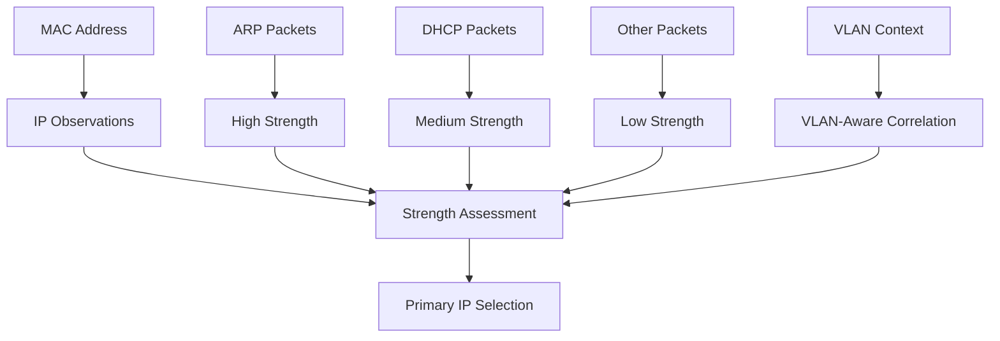

# Data Model

This document describes Zandoli's core data structures and their relationships.

## Core Data Structures

### Host Structure

The `Host` struct is the central data structure representing a discovered network device:

```go
type Host struct {
    // Primary identification
    IP               net.IP           `json:"ip,omitempty"`   // IPv4 primary
    IPv6Primary      net.IP           `json:"ipv6,omitempty"` // IPv6 primary
    IPs              []net.IP         `json:"ips,omitempty"`  // All observed IPs
    MAC              net.HardwareAddr `json:"-"`
    MACStr           string           `json:"macStr,omitempty"`
    
    // Device information
    Vendor           string           `json:"vendor,omitempty"`
    Role             string           `json:"role,omitempty"`
    RoleConfidence   int              `json:"roleConfidence,omitempty"` // 0-100
    RoleSignals      []string         `json:"roleSignals,omitempty"`
    RoleConflict     bool             `json:"roleConflict,omitempty"`
    Category         string           `json:"category,omitempty"`
    Hostname         string           `json:"hostname,omitempty"`
    
    // Network characteristics
    Protocols        []string         `json:"protocols,omitempty"`
    Info             string           `json:"info,omitempty"`
    TTL              int              `json:"ttl,omitempty"`
    TTLAvg           uint8            `json:"ttlAvg,omitempty"`
    Ports            []int            `json:"ports,omitempty"`
    VLANs            []int            `json:"vlans,omitempty"`
    VLANStats        map[int]int      `json:"vlanStats,omitempty"`
    PrimaryVLAN      int              `json:"primaryVlan,omitempty"`
    
    // OS fingerprinting
    OSGuess          string           `json:"osGuess,omitempty"`
    OSScore          uint8            `json:"osScore,omitempty"`
    OSSignals        []string         `json:"osSignals,omitempty"`
    WindowSize       int              `json:"windowSize,omitempty"`
    TCPOptions       *TCPOptions      `json:"tcpOptions,omitempty"`
    
    // Timing and statistics
    FirstSeen        time.Time        `json:"firstSeen,omitempty"`
    LastSeen         time.Time        `json:"lastSeen,omitempty"`
    PacketCount      uint64           `json:"packetCount,omitempty"`
    ByteCount        uint64           `json:"byteCount,omitempty"`
    
    // Detection metadata
    Source           string           `json:"source,omitempty"` // "passive", "active", "combined"
    OnlyARP          bool             `json:"onlyArp,omitempty"`
    SecurityFeatures []string         `json:"securityFeatures,omitempty"`
    
    // Layer 2 protocol details
    CDP              *CDPInfo         `json:"cdp,omitempty"`
    LLDP             *LLDPInfo        `json:"lldp,omitempty"`
    STP              *STPInfo         `json:"stp,omitempty"`
    L2Signals        L2SignalsInfo    `json:"l2,omitempty"`
    
    // Service information
    Services         ServicesInfo     `json:"services,omitempty"`
    
    // IP observations and protocols
    IPsAll           []IPObservation     `json:"ipsAll,omitempty"`
    ProtocolsByIP    map[string][]string `json:"protocolsByIP,omitempty"`
    
    // Anomalies and issues
    Anomalies        []Anomaly        `json:"anomalies,omitempty"`
}
```

### Layer 2 Protocol Structures

#### CDP Information
```go
type CDPInfo struct {
    DeviceID            string   `json:"device_id,omitempty"`   // TLV 0x01
    PortID              string   `json:"port_id,omitempty"`     // TLV 0x03
    Platform            string   `json:"platform,omitempty"`    // TLV 0x06
    Version             string   `json:"version,omitempty"`     // TLV 0x05
    Capabilities        uint32   `json:"capabilities,omitempty"` // TLV 0x04
    NativeVLAN          int      `json:"native_vlan,omitempty"` // TLV 0x0a
    Addresses           []string `json:"addresses,omitempty"`   // TLV 0x02
    DecodedCaps         []string `json:"decoded_caps,omitempty"`
    CapabilitiesDecoded []string `json:"capabilitiesDecoded,omitempty"`
}
```

#### LLDP Information
```go
type LLDPInfo struct {
    ChassisID    string   `json:"chassis_id,omitempty"`   // TLV 1
    PortID       string   `json:"port_id,omitempty"`      // TLV 2
    SysName      string   `json:"sys_name,omitempty"`     // TLV 5
    SysDescr     string   `json:"sys_descr,omitempty"`    // TLV 6
    MgmtAddrs    []string `json:"mgmt_addrs,omitempty"`   // TLV 8
    Capabilities []string `json:"capabilities,omitempty"` // TLV 7
}
```

#### STP Information
```go
type STPInfo struct {
    RootBridgeID string `json:"root_bridge_id,omitempty"` // Root Bridge ID
    RootPathCost uint32 `json:"root_path_cost,omitempty"` // Root Path Cost
    BridgeID     string `json:"bridge_id,omitempty"`      // Bridge ID
    PortID       uint16 `json:"port_id,omitempty"`        // Port ID
    HelloTime    uint16 `json:"hello_time,omitempty"`     // Hello Time
    MaxAge       uint16 `json:"max_age,omitempty"`        // Max Age
    ForwardDelay uint16 `json:"forward_delay,omitempty"`  // Forward Delay
    MessageAge   uint16 `json:"message_age,omitempty"`    // Message Age
    IsRoot       bool   `json:"is_root,omitempty"`        // True if root bridge
}
```

### Supporting Structures

#### TCP Options
```go
type TCPOptions struct {
    MSS             int      `json:"mss,omitempty"`
    WSCALE          int      `json:"wscale,omitempty"`
    SACKPermitted   bool     `json:"sackPermitted,omitempty"`
    Timestamp       bool     `json:"timestamp,omitempty"`
    NOPCount        int      `json:"nopCount,omitempty"`
    Order           []string `json:"order,omitempty"`
    MSSSamples      []int    `json:"mss_samples,omitempty"`
    WScaleSamples   []int    `json:"wscale_samples,omitempty"`
    TCPFPConfidence int      `json:"tcp_fp_confidence,omitempty"` // 0-100
}
```

#### Layer 2 Signals
```go
type L2SignalsInfo struct {
    VLANs []int `json:"vlans,omitempty"` // Observed VLANs
    EAPOL bool  `json:"eapol,omitempty"` // 802.1X detected
    STP   bool  `json:"stp,omitempty"`   // STP/RSTP detected
    LLDP  bool  `json:"lldp,omitempty"`  // LLDP detected
    CDP   bool  `json:"cdp,omitempty"`   // CDP detected
}
```

#### Services Information
```go
type ServicesInfo struct {
    TCP []int `json:"tcp,omitempty"` // TCP ports (sorted, unique)
    UDP []int `json:"udp,omitempty"` // UDP ports (sorted, unique)
}
```

#### IP Observation
```go
type IPObservation struct {
    IP       net.IP `json:"ip"`
    Strength string `json:"strength"` // "high", "medium", "low"
}
```

### Anomaly Structures

#### Anomaly Definition
```go
type Anomaly struct {
    Type        string                 `json:"type"`        // Anomaly type
    Severity    string                 `json:"severity"`    // "low", "medium", "high"
    Key         string                 `json:"key"`         // Deduplication key
    Parameters  map[string]interface{} `json:"parameters"`  // Type-specific data
    Scope       string                 `json:"scope"`       // "global" or "vlan:<id>"
    Description string                 `json:"description"` // Human-readable
}
```

#### Anomaly Types
- `arp_storm`: ARP flooding detected
- `mac_multiple_ip`: Multiple IPs per MAC
- `ip_duplicate_v4`: Duplicate IPv4 addresses
- `flip_suspect`: MAC↔IP flip attempts
- `duplicate_hostname`: Same hostname across devices

### Network Topology Structures

#### Subnet Entry
```go
type SubnetEntry struct {
    CIDR       string    `json:"cidr"`                // CIDR notation
    Version    string    `json:"version"`             // "ipv4" or "ipv6"
    VLAN       *int      `json:"vlan,omitempty"`      // VLAN ID (nil if untagged)
    Source     string    `json:"source"`              // "dhcp", "ra", "computed"
    HostsCount int       `json:"hostsCount"`          // Number of hosts
    IPSamples  []string  `json:"ipSamples"`           // Sample IPs (max 5)
    FirstSeen  time.Time `json:"firstSeen,omitempty"`
    LastSeen   time.Time `json:"lastSeen,omitempty"`
}
```

#### Subnet (Legacy)
```go
type Subnet struct {
    CIDR       string   `json:"cidr"`
    Source     string   `json:"source"` // "dhcp", "computed", "arp", "ndp"
    Hosts      []string `json:"hosts,omitempty"`
    CountHosts int      `json:"countHosts,omitempty"`
    VLANs      []int    `json:"vlans,omitempty"`
}
```

### Role Information

#### Role Inference Details
```go
type RoleInfo struct {
    Role       string   `json:"role,omitempty"`       // "client", "server", "reseau"
    Confidence int      `json:"confidence,omitempty"` // 0-100
    Signals    []string `json:"signals,omitempty"`    // Used signals
    Rationale  string   `json:"rationale,omitempty"`  // Human explanation
}
```

## Data Relationships

### Host Relationships

```mermaid
classDiagram
    class Host {
        +IP net.IP
        +IPv6Primary net.IP
        +IPs []net.IP
        +MAC net.HardwareAddr
        +Vendor string
        +Role string
        +RoleConfidence int
        +CDP CDPInfo
        +LLDP LLDPInfo
        +STP STPInfo
        +Services ServicesInfo
        +Anomalies []Anomaly
    }
    
    class CDPInfo {
        +DeviceID string
        +Platform string
        +Version string
        +Capabilities uint32
        +NativeVLAN int
    }
    
    class LLDPInfo {
        +ChassisID string
        +PortID string
        +SysName string
        +SysDescr string
        +Capabilities []string
    }
    
    class STPInfo {
        +RootBridgeID string
        +BridgeID string
        +RootPathCost uint32
        +PortID uint16
    }
    
    class ServicesInfo {
        +TCP []int
        +UDP []int
    }
    
    class Anomaly {
        +Type string
        +Severity string
        +Parameters map[string]interface{}
    }
    
    Host --> CDPInfo
    Host --> LLDPInfo
    Host --> STPInfo
    Host --> ServicesInfo
    Host --> Anomaly
```

### IP↔MAC Correlation



## JSON Export Examples

### Complete Host Example
```json
{
  "ip": "192.168.1.100",
  "ipv6": "2001:db8::1",
  "macStr": "00:11:22:33:44:55",
  "vendor": "Cisco Systems",
  "role": "reseau",
  "roleConfidence": 100,
  "roleSignals": ["L2_PRESENT"],
  "hostname": "switch-01",
  "protocols": ["CDP", "STP", "ARP"],
  "cdp": {
    "device_id": "switch-01.example.com",
    "platform": "WS-C2960-24TC-L",
    "version": "C2960 Software (C2960-LANBASEK9-M), Version 12.2(55)SE7",
    "capabilities": 41,
    "decoded_caps": ["Router", "Switch/Bridge"],
    "native_vlan": 1
  },
  "stp": {
    "root_bridge_id": "0000.1111.2222.3333",
    "bridge_id": "0000.4444.5555.6666",
    "root_path_cost": 4,
    "port_id": 128
  },
  "l2": {
    "vlans": [1, 10, 20],
    "cdp": true,
    "stp": true
  },
  "services": {
    "tcp": [22, 23, 80, 443],
    "udp": [161, 162]
  },
  "vlans": [1, 10, 20],
  "vlanStats": {
    "1": 150,
    "10": 75,
    "20": 25
  },
  "primaryVlan": 1,
  "source": "passive",
  "firstSeen": "2024-01-15T10:30:00Z",
  "lastSeen": "2024-01-15T12:45:00Z"
}
```

### Anomaly Example
```json
{
  "type": "mac_multiple_ip",
  "severity": "medium",
  "key": "mac:00:11:22:33:44:55/vlan:null",
  "scope": "global",
  "description": "MAC multiple IP detected",
  "parameters": {
    "ips": ["192.168.1.100", "192.168.1.101"],
    "ip_details": [
      {"ip": "192.168.1.100", "source": "ARP"},
      {"ip": "192.168.1.101", "source": "DHCP"}
    ],
    "total_count": 2
  }
}
```

### Subnet Example
```json
{
  "cidr": "192.168.1.0/24",
  "version": "ipv4",
  "source": "dhcp",
  "hostsCount": 15,
  "ipSamples": [
    "192.168.1.1",
    "192.168.1.10",
    "192.168.1.100",
    "192.168.1.150",
    "192.168.1.200"
  ],
  "firstSeen": "2024-01-15T10:30:00Z",
  "lastSeen": "2024-01-15T12:45:00Z"
}
```

## Data Validation Rules

### Host Validation
- At least one of `IP`, `IPv6Primary`, or `MACStr` must be present
- `RoleConfidence` must be 0-100
- `FirstSeen` and `LastSeen` must be valid timestamps
- `VLANs` must contain positive integers

### Protocol Data Validation
- CDP `DeviceID` must be non-empty if CDP is present
- LLDP `ChassisID` must be non-empty if LLDP is present
- STP `BridgeID` must be valid format (12 hex characters)
- TCP ports must be 1-65535 range
- UDP ports must be 1-65535 range

### Anomaly Validation
- `Type` must be one of defined anomaly types
- `Severity` must be "low", "medium", or "high"
- `Key` must be unique for deduplication
- `Parameters` must match expected schema for anomaly type

## Performance Considerations

### Memory Usage
- Host objects are kept in memory during processing
- Large PCAPs may require streaming processing
- Anomaly deduplication uses server-side keys
- VLAN statistics use efficient integer maps

### Data Structures
- Maps are used for O(1) lookups by MAC address
- Slices are pre-allocated when size is known
- JSON marshaling is optimized for large datasets
- Concurrent access is protected by mutexes

## See Also

- [Pipeline Processing](PIPELINE.md)
- [Layer 2 Protocols](L2_PROTOCOLS.md)
- [Export Formats](EXPORTS.md)
- [Architecture Overview](ARCHITECTURE.md)
