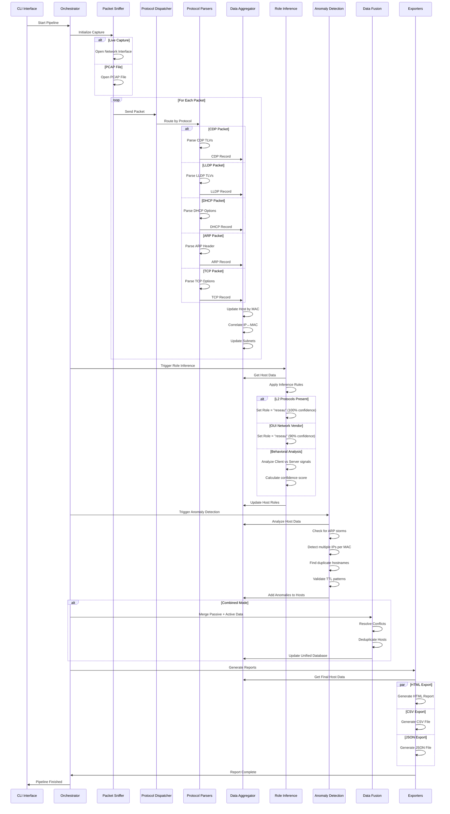

# Pipeline

This document describes Zandoli's data processing pipeline, from packet capture to report generation.

## Pipeline Overview

Zandoli processes network data through several distinct phases:

1. **Packet Capture**: Live sniffing or PCAP file reading
2. **Protocol Parsing**: Extract information from various network protocols
3. **Data Aggregation**: Correlate and merge information by MAC address
4. **Role Inference**: Determine device roles using behavioral analysis
5. **Anomaly Detection**: Identify potential network issues
6. **Data Fusion**: Combine passive and active scan results
7. **Export Generation**: Create reports in multiple formats

## Detailed Pipeline Flow



## Protocol Processing Details

### Layer 2 Protocol Processing

#### CDP (Cisco Discovery Protocol)
```
CDP Packet → Parse TLVs → Extract:
├── Device ID (TLV 0x01)
├── Port ID (TLV 0x03) 
├── Platform (TLV 0x06)
├── Software Version (TLV 0x05)
├── Capabilities (TLV 0x04)
├── Native VLAN (TLV 0x0a)
└── Management Addresses (TLV 0x02)
```

#### LLDP (Link Layer Discovery Protocol)
```
LLDP Packet → Parse TLVs → Extract:
├── Chassis ID (TLV 1)
├── Port ID (TLV 2)
├── Time to Live (TLV 3)
├── System Name (TLV 5)
├── System Description (TLV 6)
├── System Capabilities (TLV 7)
└── Management Addresses (TLV 8)
```

#### STP (Spanning Tree Protocol)
```
STP BPDU → Parse Fields → Extract:
├── Root Bridge ID
├── Bridge ID
├── Port ID
├── Root Path Cost
├── Hello Time
├── Max Age
├── Forward Delay
└── Message Age
```

#### 802.1X (EAPOL)
```
EAPOL Packet → Detect:
└── EAPOL presence (authentication activity)
```

### Layer 3 Protocol Processing

#### DHCP Processing
```
DHCP Packet → Parse Options → Extract:
├── Client MAC Address
├── Requested IP Address
├── DHCP Server IP
├── Lease Time
├── Subnet Mask
├── Router/Gateway
├── DNS Servers
└── Hostname
```

#### ARP Processing
```
ARP Packet → Parse Fields → Extract:
├── Sender MAC Address
├── Sender IP Address
├── Target MAC Address
├── Target IP Address
└── Operation Type (Request/Reply)
```

#### TCP Processing
```
TCP Packet → Parse Options → Extract:
├── Source/Destination Ports
├── TCP Options (MSS, WSCALE, SACK, etc.)
├── Window Size
├── TTL Value
└── SYN/ACK Flags
```

## Role Inference Algorithm

### Priority Matrix

The role inference follows a strict priority hierarchy:

1. **Layer 2 Protocols** (Highest Priority - 100% confidence)
   - CDP, LLDP, STP, or 802.1X presence → Role = "reseau"
   - Short-circuits all other analysis

2. **OUI Vendor Classification** (90% confidence)
   - Network equipment vendors → Role = "reseau"
   - Examples: Cisco, Juniper, Aruba, Ubiquiti

3. **Behavioral Analysis** (Variable confidence)
   - Server signals: DHCP responses, SYN-ACK on well-known ports, DNS responses
   - Client signals: SYN outbound, DNS queries, HTTP requests
   - Confidence calculated based on signal strength

### Server Detection Signals

| Signal | Score | Description |
|--------|-------|-------------|
| DHCP Offer/ACK | 25 | DHCP server responses |
| TCP SYN-ACK (well-known ports) | 25 | Server ports 80,443,22,23,21,445,139,3389,53,25 |
| DNS Response (port 53) | 25 | DNS server responses |
| HTTP Server Header | 25 | HTTP server on ports 80/443 |
| SMB Response | 20 | SMB server on ports 445/139 |
| RDP Cookie | 20 | RDP server on port 3389 |
| NTP Response | 15 | NTP server on port 123 |

### Client Detection Signals

| Signal | Score | Description |
|--------|-------|-------------|
| TCP SYN Outbound | 20 | Multiple protocols without server ports |
| DNS Query | 15 | DNS queries without server port |
| HTTP Request | 15 | HTTP requests without server port |
| SMB Request | 15 | SMB requests without server port |
| NTP Query | 10 | NTP queries without server port |

### Confidence Calculation

- **L2 Present**: 100% (absolute priority)
- **OUI Network**: 90% (high confidence)
- **Strong Server Signals**: Up to 85% (capped to allow L2 priority)
- **Strong Client Signals**: Up to 85% (capped to allow L2 priority)
- **Weak Signals**: 20-30% (fallback to client assumption)

## MAC↔IP Correlation

### Correlation Rules

1. **Direct ARP Association**: ARP request/reply establishes MAC↔IP mapping
2. **DHCP Association**: DHCP messages correlate client MAC with assigned IP
3. **Packet Source**: Source MAC/IP from any packet creates association
4. **VLAN Awareness**: Correlation is VLAN-aware (same MAC can have different IPs per VLAN)

### Conflict Resolution

- **Priority Matrix**: Higher-priority protocols override lower-priority ones
- **Anti-Flip Protection**: Prevents rapid MAC↔IP changes (flip-flop detection)
- **Strength Assessment**: "high", "medium", "low" strength levels for associations
- **Temporal Windows**: Time-based conflict resolution

## Subnet Discovery

### Subnet Sources

1. **DHCP Discoveries**: From DHCP server responses
2. **ARP Analysis**: Computed from observed IP ranges
3. **Router Advertisements**: IPv6 subnet announcements
4. **Manual Configuration**: User-defined subnets

### Subnet Classification

- **RFC 1918 Private**: 10.0.0.0/8, 172.16.0.0/12, 192.168.0.0/16
- **CGNAT**: 100.64.0.0/10
- **Link-Local**: 169.254.0.0/16 (APIPA)
- **Public**: All other IPv4 ranges
- **IPv6**: Global unicast, ULA, link-local

### Subnet Aggregation

- **Deduplication**: Remove overlapping subnets
- **Hierarchical Display**: Show /24, /16, /8 relationships
- **VLAN Awareness**: Separate subnets per VLAN
- **Host Counting**: Count unique hosts per subnet

## Anomaly Detection

### Anomaly Types

1. **ARP Storm**: Excessive ARP requests per second
2. **Multiple IPs per MAC**: MAC address with multiple IP assignments
3. **Duplicate IP**: Same IP address assigned to multiple MACs
4. **Duplicate Hostname**: Same hostname across multiple devices
5. **Suspicious TTL**: Unusual TTL values indicating potential spoofing
6. **Multiple DHCP Servers**: Multiple DHCP servers in same subnet

### Detection Algorithms

- **Threshold-Based**: Configurable thresholds for storm detection
- **Statistical Analysis**: Pattern recognition for unusual behavior
- **Cross-Reference**: Correlate data across multiple sources
- **Temporal Analysis**: Time-based anomaly detection

## Data Fusion Process

### Fusion Steps

1. **Data Collection**: Gather passive and active scan results
2. **Conflict Detection**: Identify conflicting information
3. **Priority Resolution**: Apply priority matrix for conflicts
4. **Deduplication**: Remove duplicate hosts and information
5. **Quality Assessment**: Evaluate data completeness and reliability
6. **Final Assembly**: Create unified host database

### Conflict Resolution Strategy

- **Source Priority**: L2 protocols > OUI > Behavioral analysis
- **Temporal Priority**: More recent data overrides older data
- **Confidence Weighting**: Higher confidence scores win conflicts
- **Manual Overrides**: User-defined preferences when available

## Performance Optimizations

### Memory Management

- **Streaming Processing**: Process packets without loading entire PCAP
- **Efficient Data Structures**: Optimized maps and slices for large datasets
- **Garbage Collection**: Regular cleanup of temporary data structures
- **Memory Pooling**: Reuse of packet buffers and structures

### Concurrent Processing

- **Goroutine Pools**: Controlled concurrency for packet processing
- **Channel Communication**: Efficient data passing between components
- **Lock-Free Operations**: Minimize mutex contention where possible
- **Batch Processing**: Group operations for better cache locality

### I/O Optimization

- **Buffered I/O**: Reduce system call overhead
- **Async Operations**: Non-blocking I/O where appropriate
- **Compression**: Compress large output files
- **Incremental Updates**: Update reports incrementally for large datasets

## See Also

- [Architecture Overview](ARCHITECTURE.md)
- [Data Model](DATA_MODEL.md)
- [Layer 2 Protocols](L2_PROTOCOLS.md)
- [Role Inference Details](DATA_MODEL.md#role-inference)
