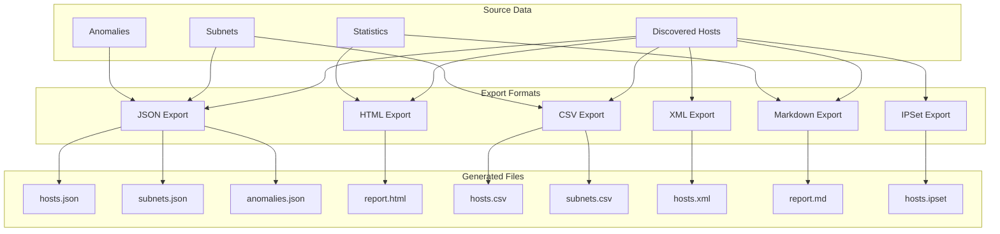
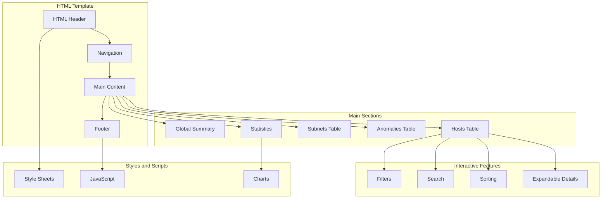
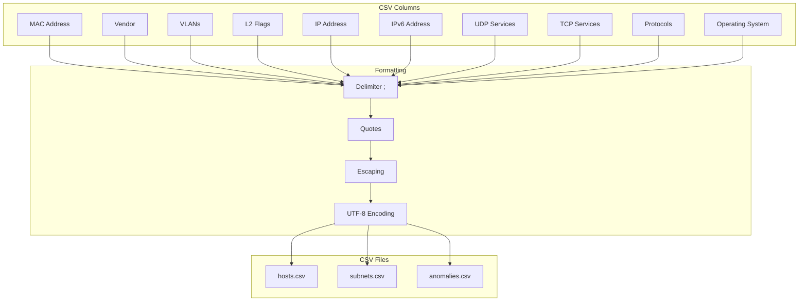
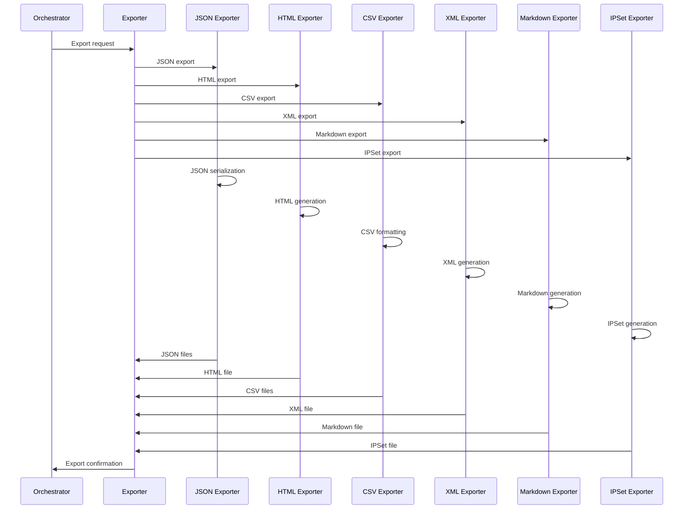
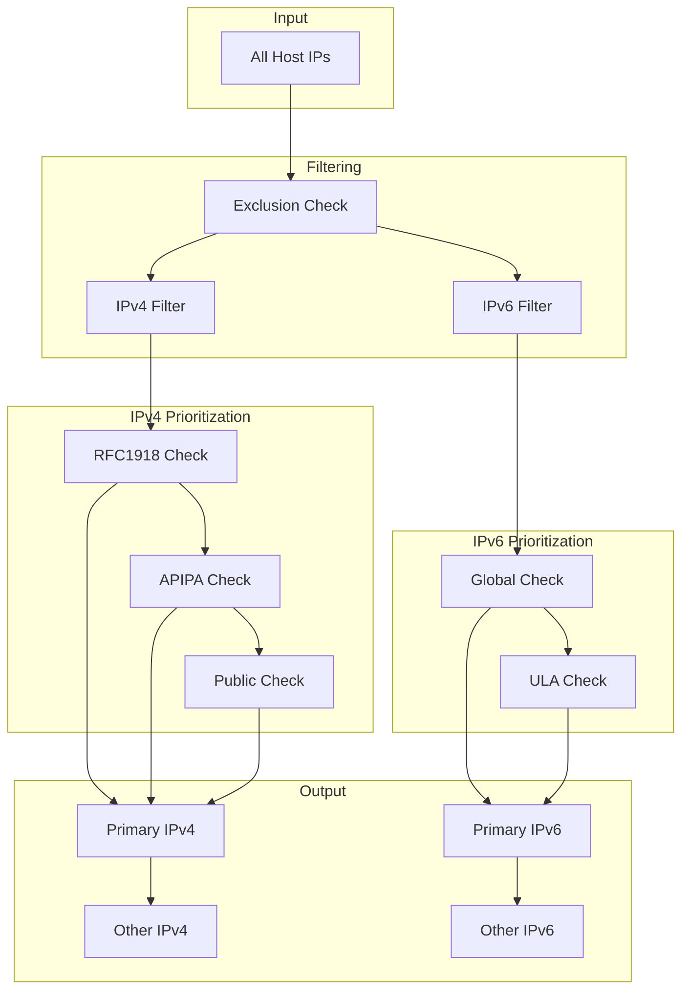
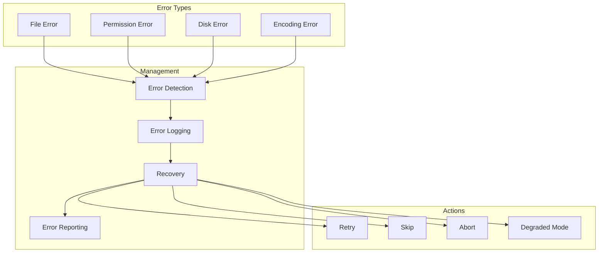
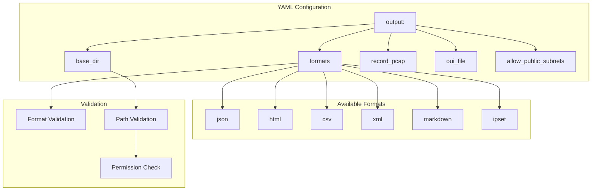

# Zandoli Export Format Schemas

## Export Overview



## JSON Structure

```mermaid
classDiagram
    class JSONHost {
        +string ip
        +string ipv6
        +string macStr
        +string vendor
        +string role
        +int roleConfidence
        +[]string roleSignals
        +[]string protocols
        +string info
        +string hostname
        +int ttl
        +string osGuess
        +uint8 osScore
        +[]string osSignals
        +int windowSize
        +TCPOptions tcpOptions
        +[]int ports
        +[]int vlans
        +map[int]int vlanStats
        +int primaryVlan
        +uint64 packetCount
        +uint64 byteCount
        +[]string securityFeatures
        +[]string ips
        +[]IPObservation ipsAll
        +map[string][]string protocolsByIP
        +L2Signals l2Signals
        +CDPInfo cdp
        +LLDPInfo lldp
        +STPInfo stp
        +[]Anomaly anomalies
        +time.Time firstSeen
        +time.Time lastSeen
    }
    
    class JSONSubnet {
        +string network
        +string gateway
        +int hostCount
        +[]string hosts
        +map[string]int roleDistribution
        +map[string]int vendorDistribution
        +[]string anomalies
    }
    
    class JSONAnomaly {
        +string type
        +string description
        +string severity
        +string key
        +string scope
        +map[string]interface{} details
    }
    
    JSONHost --> JSONAnomaly
    JSONSubnet --> JSONHost
```

## HTML Structure



## CSV Structure



## Export Generation Flow



## IP Selection for Export



## HTML Template - Detailed Structure

```mermaid
graph TD
    subgraph "HTML Header"
        DOCTYPE[DOCTYPE html]
        HTML_TAG[html lang="en"]
        HEAD[head]
        META[Meta tags]
        TITLE[Title]
        CSS_LINKS[CSS Links]
    end
    
    subgraph "Main Body"
        BODY[body]
        HEADER[header]
        NAV[nav]
        MAIN[main]
        FOOTER[footer]
    end
    
    subgraph "Main Content"
        SUMMARY_SECTION[Summary Section]
        HOSTS_SECTION[Hosts Section]
        SUBNETS_SECTION[Subnets Section]
        ANOMALIES_SECTION[Anomalies Section]
        STATS_SECTION[Statistics Section]
    end
    
    subgraph "Interactive Components"
        FILTER_PANEL[Filter Panel]
        SEARCH_BOX[Search Box]
        SORT_CONTROLS[Sort Controls]
        DETAIL_MODAL[Detail Modal]
    end
    
    DOCTYPE --> HTML_TAG
    HTML_TAG --> HEAD
    HTML_TAG --> BODY
    
    HEAD --> META
    HEAD --> TITLE
    HEAD --> CSS_LINKS
    
    BODY --> HEADER
    BODY --> NAV
    BODY --> MAIN
    BODY --> FOOTER
    
    MAIN --> SUMMARY_SECTION
    MAIN --> HOSTS_SECTION
    MAIN --> SUBNETS_SECTION
    MAIN --> ANOMALIES_SECTION
    MAIN --> STATS_SECTION
    
    HOSTS_SECTION --> FILTER_PANEL
    HOSTS_SECTION --> SEARCH_BOX
    HOSTS_SECTION --> SORT_CONTROLS
    HOSTS_SECTION --> DETAIL_MODAL
```

## Export Error Handling



## Export Metrics

```mermaid
graph TB
    subgraph "Time Metrics"
        EXPORT_TIME[Total Export Time]
        JSON_TIME[JSON Export Time]
        HTML_TIME[HTML Export Time]
        CSV_TIME[CSV Export Time]
    end
    
    subgraph "Size Metrics"
        JSON_SIZE[JSON Files Size]
        HTML_SIZE[HTML File Size]
        CSV_SIZE[CSV Files Size]
        TOTAL_SIZE[Total Size]
    end
    
    subgraph "Performance Metrics"
        HOSTS_COUNT[Exported Hosts Count]
        SUBNETS_COUNT[Subnets Count]
        ANOMALIES_COUNT[Anomalies Count]
        SUCCESS_RATE[Success Rate]
    end
    
    EXPORT_TIME --> DASHBOARD[Metrics Dashboard]
    JSON_TIME --> DASHBOARD
    HTML_TIME --> DASHBOARD
    CSV_TIME --> DASHBOARD
    
    JSON_SIZE --> DASHBOARD
    HTML_SIZE --> DASHBOARD
    CSV_SIZE --> DASHBOARD
    TOTAL_SIZE --> DASHBOARD
    
    HOSTS_COUNT --> DASHBOARD
    SUBNETS_COUNT --> DASHBOARD
    ANOMALIES_COUNT --> DASHBOARD
    SUCCESS_RATE --> DASHBOARD
```



## Export Configuration


