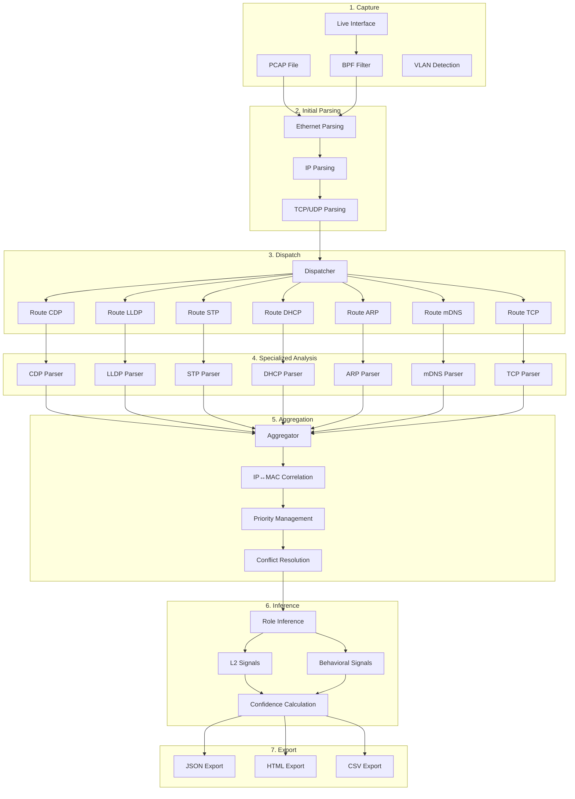
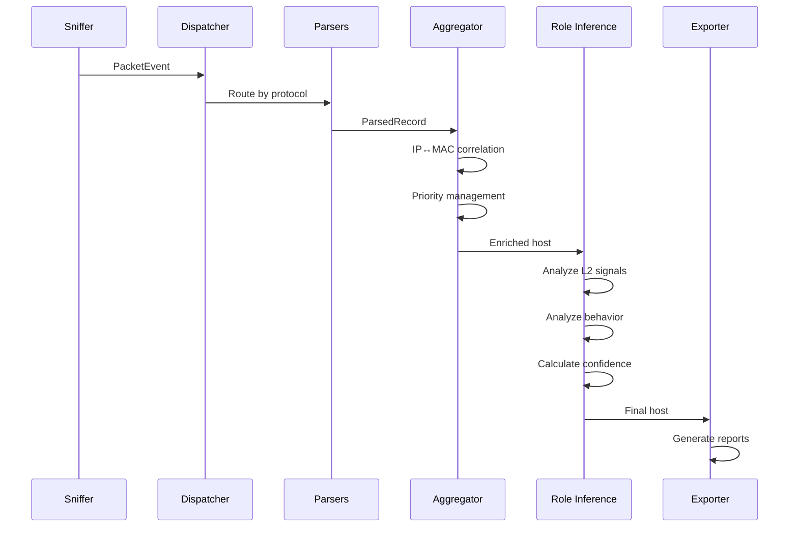
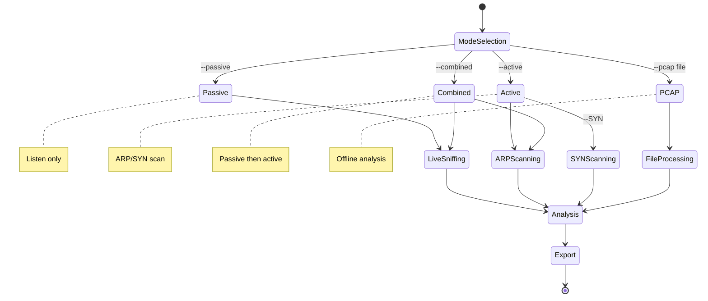
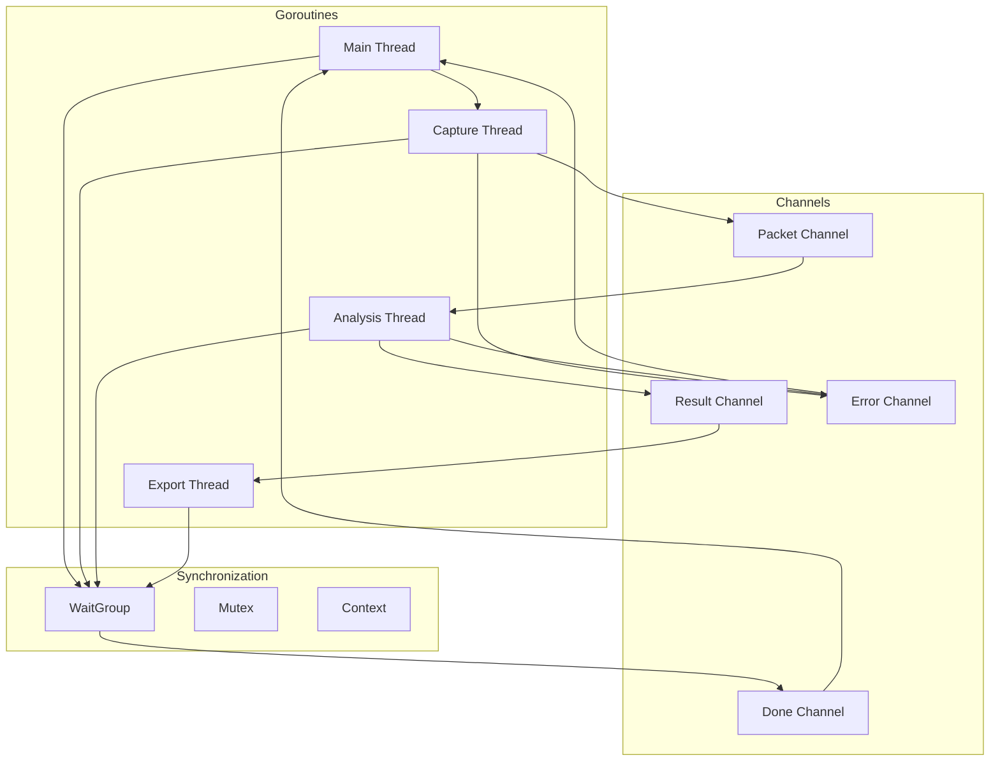
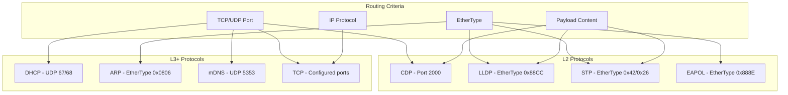
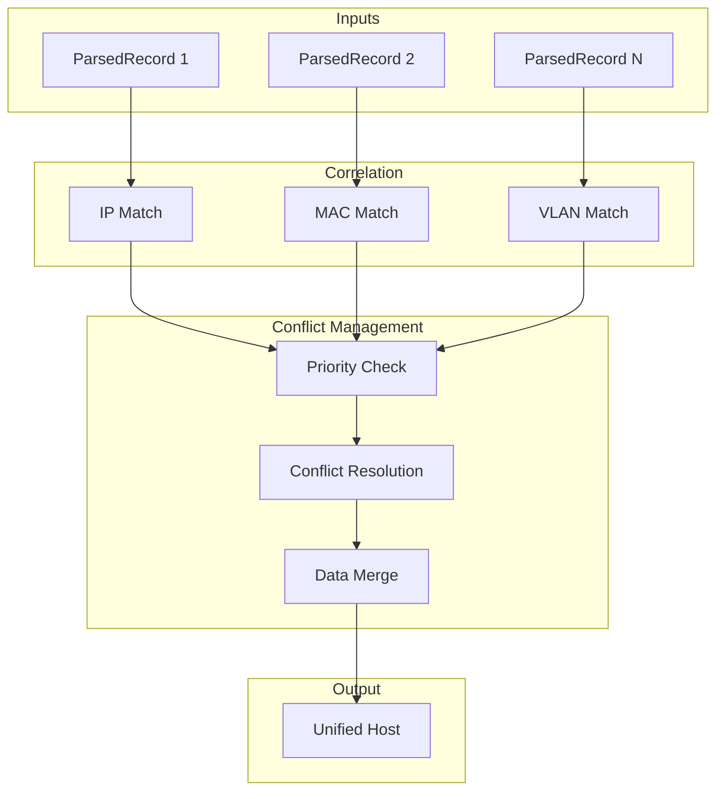
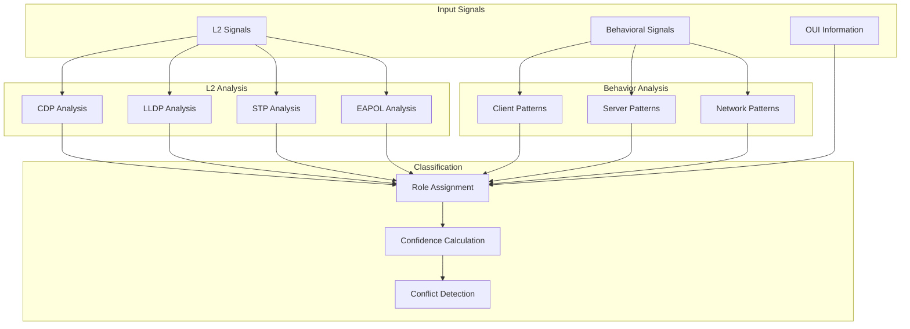
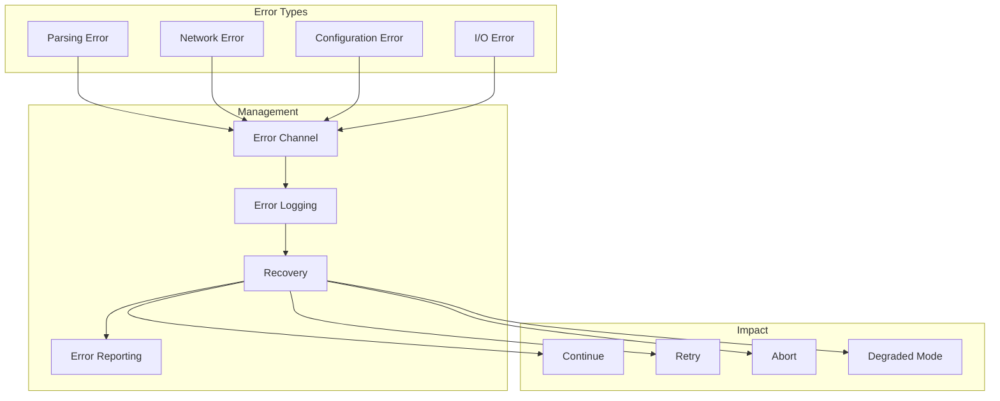
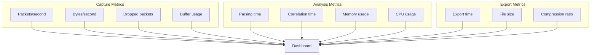

# Zandoli Processing Pipeline Schemas

## Pipeline Overview

## Detailed Data Flow

## Execution Modes

## Concurrency Management

## Parsing Pipeline

```mermaid
flowchart LR
    subgraph "Ethernet Parsing"
        ETH_HEADER[Ethernet Header]
        ETH_TYPE[EtherType]
        VLAN_TAG[VLAN Tag 802.1Q]
    end
    
    subgraph "IP Parsing"
        IP_HEADER[IP Header]
        IP_VERSION[IPv4/IPv6 Version]
        IP_TTL[TTL/Hop Limit]
        IP_PROTO[Protocol]
    end
    
    subgraph "Transport Parsing"
        TCP_HEADER[TCP Header]
        UDP_HEADER[UDP Header]
        TCP_OPTIONS[TCP Options]
        PORTS[Source/Dest Ports]
    end
    
    subgraph "Application Parsing"
        PAYLOAD[Payload]
        PROTOCOL_ID[Protocol Identification]
        TLV_PARSING[TLV Parsing]
    end
    
    ETH_HEADER --> ETH_TYPE
    ETH_TYPE --> VLAN_TAG
    VLAN_TAG --> IP_HEADER
    IP_HEADER --> IP_VERSION
    IP_VERSION --> IP_TTL
    IP_TTL --> IP_PROTO
    IP_PROTO --> TCP_HEADER
    IP_PROTO --> UDP_HEADER
    TCP_HEADER --> TCP_OPTIONS
    TCP_OPTIONS --> PORTS
    UDP_HEADER --> PORTS
    PORTS --> PAYLOAD
    PAYLOAD --> PROTOCOL_ID
    PROTOCOL_ID --> TLV_PARSING
```

## Protocol Dispatch

## Aggregation and Correlation

## Role Inference

## Error Management

## Metrics and Performance

