# Zandoli Supported Protocol Schemas

## Protocol Overview

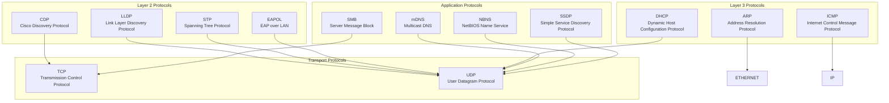

## CDP (Cisco Discovery Protocol)

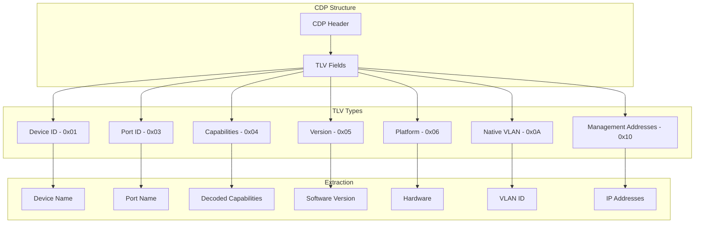

## LLDP (Link Layer Discovery Protocol)

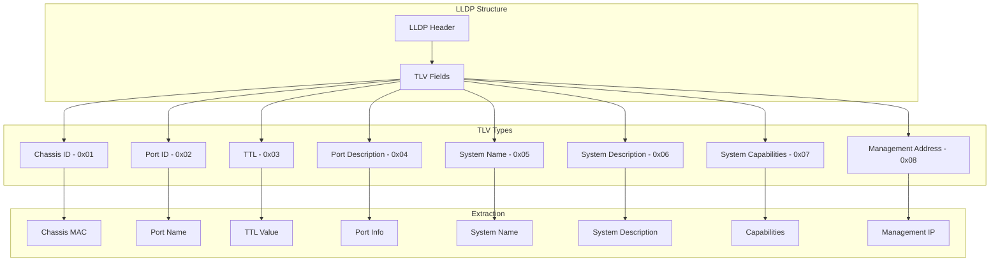

## STP (Spanning Tree Protocol)

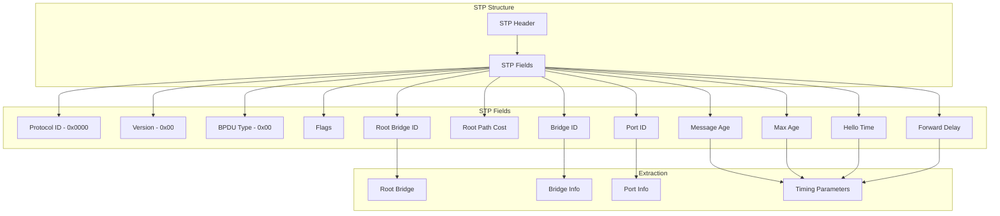

## DHCP (Dynamic Host Configuration Protocol)

```mermaid
graph TD
    subgraph "DHCP Structure"
        DHCP_HEADER[DHCP Header]
        DHCP_OPTIONS[DHCP Options]
    end
    
    subgraph "DHCP Fields"
        OP[Opcode - 1=Request, 2=Reply]
        HTYPE[HType - Hardware Type]
        HLEN[HLen - Hardware Length]
        HOPS[Hops]
        XID[Transaction ID]
        SECS[Seconds]
        FLAGS[Flags]
        CIADDR[Client IP Address]
        YIADDR[Your IP Address]
        SIADDR[Server IP Address]
        GIADDR[Gateway IP Address]
        CHADDR[Client Hardware Address]
        SNAME[Server Name]
        FILE[Boot Filename]
        OPTIONS[Options]
    end
    
    subgraph "Important Options"
        OPT_53[Option 53 - Message Type]
        OPT_54[Option 54 - Server Identifier]
        OPT_61[Option 61 - Client Identifier]
        OPT_12[Option 12 - Host Name]
        OPT_60[Option 60 - Vendor Class]
    end
    
    subgraph "Extraction"
        MSG_TYPE[Message Type]
        CLIENT_MAC[Client MAC]
        CLIENT_IP[Client IP]
        SERVER_IP[Server IP]
        HOSTNAME[Hostname]
        VENDOR_CLASS[Vendor Class]
    end
    
    DHCP_HEADER --> DHCP_OPTIONS
    DHCP_OPTIONS --> OPT_53
    DHCP_OPTIONS --> OPT_54
    DHCP_OPTIONS --> OPT_61
    DHCP_OPTIONS --> OPT_12
    DHCP_OPTIONS --> OPT_60
    
    OPT_53 --> MSG_TYPE
    CHADDR --> CLIENT_MAC
    YIADDR --> CLIENT_IP
    SIADDR --> SERVER_IP
    OPT_12 --> HOSTNAME
    OPT_60 --> VENDOR_CLASS
```

## ARP (Address Resolution Protocol)

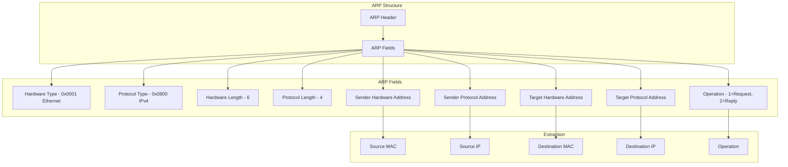

## mDNS (Multicast DNS)

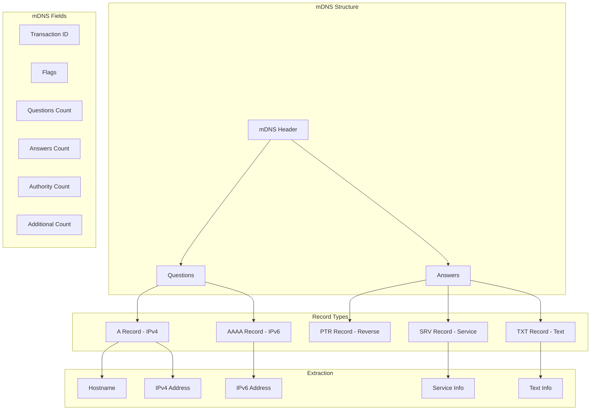

## TCP Fingerprinting

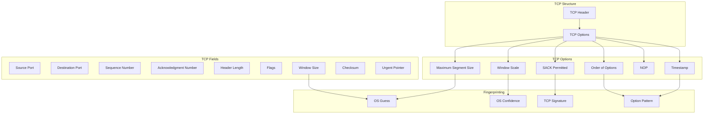

## Parsing Flow by Protocol

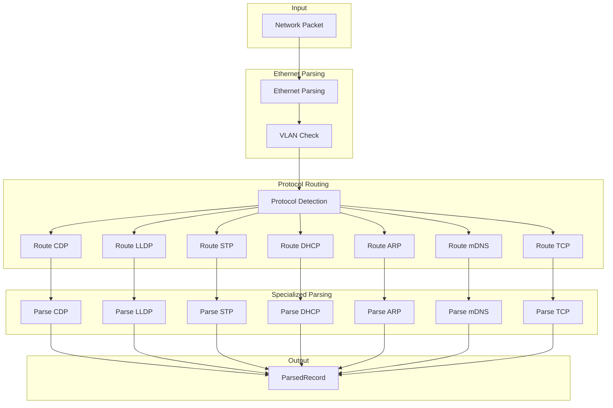

## Protocol Priorities

```mermaid
graph TB
    subgraph "High Priority - L2 Signals"
        CDP_PRIO[CDP - Priority 100]
        LLDP_PRIO[LLDP - Priority 90]
        STP_PRIO[STP - Priority 80]
        EAPOL_PRIO[EAPOL - Priority 70]
    end
    
    subgraph "Medium Priority - Network Protocols"
        DHCP_PRIO[DHCP - Priority 60]
        ARP_PRIO[ARP - Priority 50]
        MDNS_PRIO[mDNS - Priority 40]
    end
    
    subgraph "Low Priority - Transport"
        TCP_PRIO[TCP - Priority 30]
        UDP_PRIO[UDP - Priority 20]
        OTHER_PRIO[Others - Priority 10]
    end
    
    CDP_PRIO --> CONFLICT_RESOLUTION
    LLDP_PRIO --> CONFLICT_RESOLUTION
    STP_PRIO --> CONFLICT_RESOLUTION
    EAPOL_PRIO --> CONFLICT_RESOLUTION
    DHCP_PRIO --> CONFLICT_RESOLUTION
    ARP_PRIO --> CONFLICT_RESOLUTION
    MDNS_PRIO --> CONFLICT_RESOLUTION
    TCP_PRIO --> CONFLICT_RESOLUTION
    UDP_PRIO --> CONFLICT_RESOLUTION
    OTHER_PRIO --> CONFLICT_RESOLUTION
    
    CONFLICT_RESOLUTION[IP↔MAC Conflict Resolution]
```

## Protocol-Specific Anomaly Detection

```mermaid
graph TD
    subgraph "DHCP Anomalies"
        MULTIPLE_DHCP[Multiple DHCP Servers]
        SUSPICIOUS_DHCP[Suspicious DHCP Behavior]
    end
    
    subgraph "ARP Anomalies"
        ARP_SPOOFING[ARP Spoofing Attempts]
        ARP_STORM[ARP Storm Detection]
    end
    
    subgraph "TCP Anomalies"
        SUSPICIOUS_TTL[Suspicious TTL Values]
        UNUSUAL_PORTS[Unusual Port Combinations]
    end
    
    subgraph "MAC Anomalies"
        BROADCAST_MAC[Broadcast MAC Address]
        MULTICAST_MAC[Multicast MAC Address]
        LOCAL_MAC[Locally Administered MAC]
    end
    
    MULTIPLE_DHCP --> ANOMALY_DETECTION
    SUSPICIOUS_DHCP --> ANOMALY_DETECTION
    ARP_SPOOFING --> ANOMALY_DETECTION
    ARP_STORM --> ANOMALY_DETECTION
    SUSPICIOUS_TTL --> ANOMALY_DETECTION
    UNUSUAL_PORTS --> ANOMALY_DETECTION
    BROADCAST_MAC --> ANOMALY_DETECTION
    MULTICAST_MAC --> ANOMALY_DETECTION
    LOCAL_MAC --> ANOMALY_DETECTION
    
    ANOMALY_DETECTION[Anomaly Detection]
```
